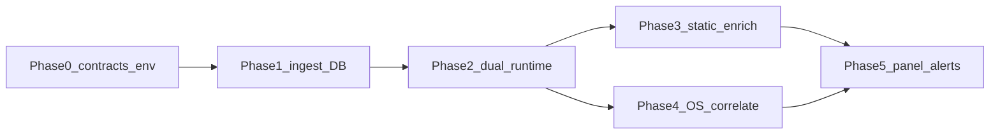

# Building the Paperboy Observability System

> Created: 2026-03-28
> Updated: 2026-03-30 (added executable phased roadmap §11.7)
> Author: Xinyao Chen
> Status: Draft
> Related document: [Paperboy Frontend Rewrite Plan](./paperboy-frontend-rewrite.md) — Section 4.2 "Observability + Reliability"

This document defines the architecture and implementation plan for Paperboy's observability system. It combines three proprietary tools — ohbug (runtime error tracking), kly (static code intelligence), and the Paperboy OS capture layer — into a unified pipeline that produces enriched error reports with full runtime, code, and user-activity context. Covers system architecture, data flows, cloud aggregation, the observability dashboard, and a phased delivery roadmap.

## 1. Vision

**Any error can be traced to its root cause — automatically, with full context, without asking the user "what did you do?"**

The Paperboy observability system is not another Sentry clone. It combines three proprietary tools that no competitor can replicate:

| Layer                   | Tool                      | What It Provides                                                             |
| ----------------------- | ------------------------- | ---------------------------------------------------------------------------- |
| **Runtime errors**      | ohbug (SDK + Dashboard)   | Error capture, aggregation, source map resolution, alerts, session replay    |
| **Static code context** | kly                       | File-level code index, dependency graph, git history, LLM-generated metadata |
| **OS-level context**    | Paperboy OS capture layer | Screenshots, keystrokes, clipboard, window switches, accessibility tree      |

When an error occurs, these three data streams converge in the cloud, producing an **Enriched Error Report** that tells you not just _what_ broke, but _why_ it likely broke, _who_ changed it, _how far_ the damage spreads, and _what the user was doing_ at the exact moment.

---

## 2. System Architecture

```
┌─────────────────────────────────┐        ┌───────────────────────────────────┐
│   macOS Client (thin client)     │        │            Cloud                   │
│                                  │        │                                    │
│  ┌────────────────────────────┐  │ upload │  ┌──────────────────────────────┐  │
│  │ OS Capture Layer (Swift)    │──┼───────→│  │ OS Data Storage               │  │
│  │ Accessibility / Screenshots │  │        │  │ screenshots / keystrokes /    │  │
│  │ Keystrokes / Clipboard      │  │        │  │ clipboard / window switches   │  │
│  └────────────────────────────┘  │        │  └──────────────┬───────────────┘  │
│                                  │        │                 │                   │
│  ┌────────────────────────────┐  │        │  ┌──────────────▼───────────────┐  │
│  │ WebView (React SPA)         │  │  API   │  │  paperboy-platform           │  │
│  │                             │←─┼───────→│  │  ┌─────────────────────────┐ │  │
│  │ @ohbug/browser captures     │  │        │  │  │ KlyService              │ │  │
│  │ errors → reports to cloud   │──┼───────→│  │  │ enrichErrorStack()      │ │  │
│  │                             │  │        │  │  └─────────────────────────┘ │  │
│  │ Observability Panel         │  │        │  │  ohbug event ingestion       │  │
│  │ (issues, metrics, alerts)   │  │        │  │  source map resolution       │  │
│  └────────────────────────────┘  │        │  │  alert evaluation             │  │
│                                  │        │  └──────────────┬───────────────┘  │
│  ┌────────────────────────────┐  │        │                 │                   │
│  │ Native Shell (Swift)        │  │        │  ┌──────────────▼───────────────┐  │
│  │ Window / Notification / Orb │  │        │  │ Observability Database       │  │
│  └────────────────────────────┘  │        │  │ PostgreSQL + Redis + files   │  │
│                                  │        │  └──────────────────────────────┘  │
└─────────────────────────────────┘        └───────────────────────────────────┘
```

---

## 3. ohbug — Runtime Error Monitoring

ohbug is a self-hosted error monitoring system consisting of two repositories:

- **ohbug** (`~/work/ohbug`) — SDK monorepo: client-side error capture, reporting, and extensions
- **ohbug-dashboard** (`~/work/ohbug-dashboard`) — Full-stack dashboard: event ingestion, aggregation, visualization, alerts

### 3.1 ohbug SDK Architecture

The SDK is a pnpm monorepo built with Vite+ (`vp pack`), TypeScript, Apache-2.0 licensed.

#### Package Map

| Package                         | Purpose                                                                                                    |
| ------------------------------- | ---------------------------------------------------------------------------------------------------------- |
| **@ohbug/types**                | Shared TypeScript type declarations (`OhbugEvent`, `OhbugClient`, `OhbugExtension`, `OhbugConfig`)         |
| **@ohbug/utils**                | Internal helpers: `getGlobal`, `getOhbugObject`, logger, validators, DOM utilities                         |
| **@ohbug/core**                 | Client lifecycle, event creation, `notify` pipeline, extension orchestration, `EventTypes`                 |
| **@ohbug/browser**              | Browser SDK: global error listeners, XHR/Fetch/WebSocket monkey-patches, breadcrumb capture, HTTP notifier |
| **@ohbug/react**                | `OhbugErrorBoundary` — React Error Boundary that captures render errors                                    |
| **@ohbug/vue**                  | Vue 2/3 `config.errorHandler` integration                                                                  |
| **@ohbug/angular**              | Angular `ErrorHandler` provider factory                                                                    |
| **@ohbug/cli**                  | Node CLI: interactive source map upload to dashboard                                                       |
| **@ohbug/unplugin**             | Build plugin (Vite/Rollup/Webpack) for automatic `.map` file upload                                        |
| **@ohbug/extension-rrweb**      | Session replay: rrweb `record`, attaches recording events to ohbug event metadata                          |
| **@ohbug/extension-web-vitals** | Core Web Vitals (FCP/LCP/CLS/FID) → `category: "performance"` events                                       |
| **@ohbug/extension-uuid**       | Anonymous user tracking via UUID                                                                           |
| **@ohbug/extension-view**       | Page visibility + URL change tracking                                                                      |
| **@ohbug/extension-feedback**   | User feedback UI (Solid.js + Tailwind)                                                                     |

#### Error Capture Pipeline

```
1. Initialization
   Ohbug.setup(config) → creates Client → registers OhbugBrowser extension
                                          → installs capture handlers

2. Capture → Dispatch → Handle
   ┌─ window "error" event ──────→ scriptDispatcher ──→ uncaughtErrorHandler
   ├─ window "unhandledrejection" ──────────────────→ unhandledrejectionHandler
   ├─ XHR monkey-patch ─────────→ networkDispatcher → ajaxErrorHandler
   ├─ fetch monkey-patch ───────→ networkDispatcher → fetchErrorHandler
   ├─ WebSocket monkey-patch ──→ networkDispatcher → websocketErrorHandler
   ├─ Resource load failure ────→ scriptDispatcher ──→ resourceErrorHandler
   └─ React ErrorBoundary ──────────────────────────→ reactErrorHandler

3. Event Creation
   handler builds detail → client.createEvent({ category, type, detail })
   → handleEventCreated: reduce chain (config.onEvent → extensions.onEvent)
   → any step can return null to drop the event

4. Reporting
   client.notify(event)
   → browser notifier: POST JSON to config.endpoint
     (prefers navigator.sendBeacon, falls back to XHR)
   → runs onNotify hooks from config + extensions

5. Breadcrumbs
   client.addAction() → ring buffer (maxActions, default 30)
   → copied into each new event as `actions` array
```

#### Core Type Definitions

```typescript
interface OhbugEvent {
  apiKey: string;
  appVersion?: string;
  appType?: string;
  releaseStage?: string;
  timestamp: string;
  category: "error" | "message" | "feedback" | "view" | "performance" | "other";
  type: string; // EventTypes: UNCAUGHT_ERROR, RESOURCE_ERROR, AJAX_ERROR, FETCH_ERROR, WEBSOCKET_ERROR, REACT, VUE, ANGULAR, ...
  sdk: { platform: string; version: string };
  detail: unknown;
  device: OhbugDevice;
  user?: OhbugUser;
  actions?: OhbugAction[];
  metadata?: OhbugMetadata;
}

interface OhbugExtension {
  name: string;
  onSetup?(client: OhbugClient): void;
  onDestroy?(client: OhbugClient): void;
  onEvent?(event: OhbugEvent, client: OhbugClient): OhbugEvent | null;
  onNotify?(event: OhbugEvent, client: OhbugClient): void;
}

interface OhbugConfig {
  apiKey: string;
  endpoint: string;
  maxActions?: number; // default 30
  onEvent?(event: OhbugEvent): OhbugEvent | null;
  onNotify?(event: OhbugEvent): void;
  user?: OhbugUser;
  metadata?: OhbugMetadata;
  logger?: OhbugLogger;
}
```

#### Source Map Upload

The SDK includes two mechanisms for source map upload:

1. **@ohbug/cli** — Interactive CLI: `ohbug upload` prompts for API key, selects `.map` files
2. **@ohbug/unplugin** — Build plugin: auto-uploads maps after Vite/Rollup/Webpack build

Both upload to the dashboard's `POST /sourceMap/upload` endpoint with `apiKey`, `appVersion`, and the map file.

### 3.2 ohbug-dashboard Architecture

The dashboard is a full-stack application on the `feature/shadcn` branch (23 commits ahead of `main`), migrated to a modern stack:

#### Tech Stack

| Layer            | Technology                                                                                               |
| ---------------- | -------------------------------------------------------------------------------------------------------- |
| Web UI           | Vite + TanStack Start + TanStack Router, React 19, Nitro (SSR), Tailwind CSS v4, TanStack Query, Zustand |
| Dashboard API    | oRPC (`@orpc/server` / `@orpc/client`) over fetch at `/api/rpc`                                          |
| Auth             | Better Auth + Drizzle adapter                                                                            |
| Ingestion Server | Hono + @hono/node-server (port 6660)                                                                     |
| Job Queue        | BullMQ + Redis                                                                                           |
| Database         | PostgreSQL + Drizzle ORM                                                                                 |
| Source Maps      | source-map-trace                                                                                         |

#### Database Schema (Drizzle)

| Domain        | Tables                                                                                       |
| ------------- | -------------------------------------------------------------------------------------------- |
| Auth          | `user`, `session`, `account`, `verification` (Better Auth)                                   |
| Project       | `project`, `users_on_projects`                                                               |
| Issues/Events | `issue`, `event`, `event_user`, `event_users_on_issues`, `event_users_on_projects`           |
| Metrics       | `metric`, `feedback`, `page_view`, `user_view`                                               |
| Alerts        | `alert` (conditions/filters/actions as JSON, levels: serious/warning/default), `alert_event` |
| Releases      | `release` with `sourceMaps` JSONB column                                                     |

#### Ingestion Pipeline

```
SDK POST → Hono /
  │
  ├─ category: "error"  → BullMQ "document" queue (3s delay)
  │                         → event.worker: persist event → upsert issue
  │                           → aggregate counts → maybe enqueue "alert"
  │
  ├─ category: "performance" → metric job
  ├─ category: "feedback"    → feedback job
  ├─ category: "view"        → pageView / userView job
  │
  └─ alert.worker: evaluate rules → email/webhook → alert_event rows

Source Map Upload:
  POST /sourceMap/upload → BullMQ "sourceMap" queue
    → source-map.worker: upsert release → store file to .uploads/
    → max 5000 maps per release (FIFO eviction)
```

#### Dashboard Pages

| Route              | Feature                                                                    |
| ------------------ | -------------------------------------------------------------------------- |
| `/issues`          | Issue list: sort by Last seen / First seen / Events / Users                |
| `/issues/$issueId` | Issue detail: 24h/14d trend bars, latest event detail, source-mapped stack |
| `/feedbacks`       | User feedback list + detail                                                |
| `/alerts`          | Alert rules: create/edit/delete, event trends                              |
| `/metrics`         | Performance metrics                                                        |
| `/releases`        | Release list, uploaded source maps per release                             |
| `/users`           | Affected users                                                             |
| `/settings`        | Project settings                                                           |

#### Source Map Resolution

1. SDK or CLI uploads `.map` files to `POST /sourceMap/upload` with `apiKey` + `appVersion`
2. Dashboard stores files on disk (`.uploads/`), metadata in `release.sourceMaps` JSONB
3. When viewing an event, the `event.get` oRPC procedure uses `source-map-trace` to resolve stack frames against the matching release's source maps
4. Resolved source location displayed alongside the raw stack

### 3.3 ohbug Integration Plan for Paperboy

#### What We Use Directly

| Package                       | Integration                                               |
| ----------------------------- | --------------------------------------------------------- |
| `@ohbug/browser`              | `npm install` into React SPA, captures all runtime errors |
| `@ohbug/react`                | `OhbugErrorBoundary` wrapping top-level components        |
| `@ohbug/extension-rrweb`      | Session replay recording                                  |
| `@ohbug/extension-web-vitals` | Core Web Vitals monitoring                                |
| `@ohbug/unplugin`             | Auto-upload source maps on build                          |

#### What We Need to Add

| Component                      | Description                                                                                                                                        |
| ------------------------------ | -------------------------------------------------------------------------------------------------------------------------------------------------- |
| `@ohbug/webview`               | New extension: captures WebView bridge errors (Swift↔WebView communication failures, bridge timeouts)                                              |
| Dashboard component extraction | Extract issue list, issue detail, trend charts, alert management from ohbug-dashboard into embeddable React components for the Observability panel |
| Santi as ingestion backend     | Route ohbug events through Santi's API instead of the standalone Hono server, enabling cloud-side enrichment with kly + OS context                 |

---

## 4. kly — Static Code Context

kly (`~/work/kly`) is a file-level code repository indexing tool. It parses code structure via tree-sitter AST, uses LLM to generate human-readable file metadata, and stores everything in per-branch SQLite databases.

### 4.1 Current Capabilities (v0.2)

> kly v0.2 is **agent-first**: all CLI commands output JSON by default (`--pretty` for human-readable). MCP support has been removed — kly is now a **library** (direct `import` from `"kly"`) + **CLI tool**.

| Capability                   | Status | Description                                                                                               |
| ---------------------------- | ------ | --------------------------------------------------------------------------------------------------------- |
| Tree-sitter AST parsing      | ✅     | TypeScript / JavaScript / Swift                                                                           |
| LLM file metadata generation | ✅     | File description, summary, symbol descriptions                                                            |
| Git-aware incremental build  | ✅     | Per-branch SQLite, only re-indexes changed files                                                          |
| FTS5 full-text search        | ✅     | BM25 ranking + optional LLM rerank                                                                        |
| Dependency graph + table     | ✅     | File-level `dependencies` table with `from_path`/`to_path`, indexed for fast reverse lookup               |
| `getDependents()`            | ✅     | Query all files that import a given file (reverse dependencies)                                           |
| `getFileHistory()`           | ✅     | Query git commit history for a specific file                                                              |
| `enrichErrorStack()`         | ✅     | Enrich error stack frames with code context, dependencies, and git history                                |
| CLI                          | ✅     | 11 commands: `init`/`build`/`query`/`show`/`overview`/`graph`/`dependents`/`history`/`enrich`/`hook`/`gc` |

### 4.2 Core Type Definitions

```typescript
interface FileIndex {
  path: string;
  name: string; // LLM-generated file name
  description: string; // LLM-generated file description
  language: Language; // typescript | javascript | swift
  imports: string[];
  exports: string[];
  symbols: SymbolInfo[]; // functions/classes/interfaces/types/enums/variables
  summary: string; // LLM-generated file summary
  hash: string;
  indexedAt: number;
}

interface SymbolInfo {
  name: string;
  kind: SymbolKind; // class | function | method | interface | type | enum | variable | protocol | struct
  description: string;
}

interface DependencyGraph {
  nodes: Map<string, GraphNode>;
  edges: GraphEdge[]; // { from, to }
}
```

### 4.3 Library Exports

kly is already a cleanly exported TypeScript library (`src/index.ts`):

- `IndexDatabase` — SQLite database operations (CRUD, search)
- `buildIndex()` — Build/incremental index update
- `searchFiles()` / `searchFilesWithRerank()` — Search
- `buildDependencyGraph()` / `generateMermaid()` — Dependency graph
- `scanFiles()` — File scanning
- `ParserManager` — Tree-sitter parser management
- `LLMService` — LLM invocation
- Git utility functions (`getCurrentBranch`, `getChangedFiles`, etc.)
- Store functions (`openDatabase`, `loadState`, etc.)

### 4.4 Known Issues

| Issue                                                | Severity | Description                                                                         |
| ---------------------------------------------------- | -------- | ----------------------------------------------------------------------------------- |
| `better-sqlite3` ABI incompatibility                 | 🔴       | Node v24 binary vs vite-plus Node v25 wrapper. Mitigated by running Santi on Bun.   |
| Rough LLM provider error handling                    | 🟡       | Invalid API key reports "Unexpected end of JSON input" — should report clear error. |
| Dependency graph only resolves relative path imports | 🟡       | Does not track `node_modules` package imports, dynamic imports, or re-exports.      |

---

## 5. The Intersection — `enrich_error_stack`

This is the core integration point where ohbug's runtime data meets kly's static code context. Error stacks captured by ohbug obtain full code context through kly.

### 5.1 Before vs After

**Without kly (traditional mode):**

```
TypeError: Cannot read property 'content' of undefined
    at renderMessage (MessageList.tsx:142)
    at Array.map (<anonymous>)
    at ChatPanel (ChatPanel.tsx:87)
```

→ You only know line 142 crashed. Then manually search the code, manually assess blast radius.

**With kly + ohbug (target mode):**

```
TypeError: Cannot read property 'content' of undefined
    at renderMessage (MessageList.tsx:142)

    ┌─ kly: MessageList.tsx
    │  Description: Chat message list rendering component, handles streaming/markdown/attachment
    │  symbols: renderMessage(), useScrollPosition(), MessageBubble
    │  imports from: ChatStore, MessageTypes, MarkdownRenderer
    │  imported by: ChatPanel, WorkspaceChat, DetachedChatWindow (5 consumers)
    │
    │  Risk propagation: ChatPanel.tsx → WorkspaceRoot.tsx → App.tsx
    │  Errors in this file (last 30 days): 3 (high-frequency module)
    │  Last modified: commit abc1234 by @yanan-li (3 days ago, PR #236)
    └─
```

### 5.2 Function Signature

```typescript
interface EnrichedFrame {
  file: string;
  line: number;
  column?: number;
  function?: string;

  // kly index enrichment
  fileDescription: string;
  fileSummary: string;
  symbols: SymbolInfo[];
  language: Language;

  // kly graph enrichment
  importedBy: string[]; // reverse dependencies
  importsFrom: string[]; // forward dependencies
  riskPropagation: string[]; // BFS expansion paths

  // git enrichment
  lastModified: GitCommit | null;
  recentCommits: GitCommit[];
}

interface EnrichedErrorStack {
  originalStack: string;
  frames: EnrichedFrame[];
  affectedModules: number;
  riskLevel: "low" | "medium" | "high" | "critical";
}

export function enrichErrorStack(
  db: IndexDatabase,
  root: string,
  stack: string | ErrorFrame[],
): EnrichedErrorStack;
```

### 5.3 Implementation Flow

```
Input: error stack (string or parsed frames)
  │
  ├── 1. Parse stack trace → extract file + line + function
  │      (if input is string, parse with error-stack-parser)
  │
  ├── 2. For each frame:
  │      ├── db.getFile(frame.file)         → file description, symbols, summary
  │      ├── getDependents(db, frame.file)  → reverse dependencies
  │      ├── graph.buildDependencyGraph()   → risk propagation paths
  │      └── getFileHistory(root, frame.file) → recent modifications
  │
  ├── 3. Calculate riskLevel:
  │      ├── Dependency fan-out > 10 → +1 level
  │      ├── Modified within last 7 days → +1 level
  │      ├── Historical error count > 3 (requires ohbug data) → +1 level
  │      └── low(0) / medium(1) / high(2) / critical(3)
  │
  └── 4. Assemble and return EnrichedErrorStack
```

### 5.4 kly APIs Used (Already Implemented in v0.2)

> All APIs listed below are already implemented and exported in kly v0.2. No additional kly work is needed for the enrichment pipeline.

**`getDependents()` — Reverse dependency query:**

```typescript
export function getDependents(db: IndexDatabase, filePath: string): string[] {
  // Uses the `dependencies` table for fast indexed lookup
  // SELECT from_path FROM dependencies WHERE to_path = ?
}
```

**`getFileHistory()` — Git history query:**

```typescript
interface GitCommit {
  hash: string;
  author: string;
  email: string;
  date: number;
  message: string;
}

export function getFileHistory(root: string, filePath: string, limit?: number): GitCommit[];
```

**`dependencies` table (built during indexing):**

```sql
CREATE TABLE IF NOT EXISTS dependencies (
  from_path TEXT NOT NULL,
  to_path TEXT NOT NULL,
  PRIMARY KEY (from_path, to_path)
);

CREATE INDEX IF NOT EXISTS idx_deps_to ON dependencies(to_path);
-- Reverse query: SELECT from_path FROM dependencies WHERE to_path = ?
```

**CLI equivalents:**

```bash
kly dependents <path>     # query reverse dependencies
kly history <path>        # query git history for a file
kly enrich --frames '...' # enrich error stack frames (JSON input/output)
kly graph --focus <path>  # dependency graph for a file
```

---

## 6. Santi Integration — The Orchestration Layer

**Naming note:** This section describes the **cloud orchestration role** (kly, ohbug-shaped events, OS context). The concrete deployment target is **paperboy-platform** (see **Section 11**). The **macOS Santi daemon** owns the WebSocket bridge and OS capture—same product name, different layer: the client streams data up; the cloud aggregates and enriches.

The orchestration layer imports kly as a library when the runtime allows, ingests browser and server error events via API, and correlates OS context using timestamps and session keys.

### 6.1 KlyService

```typescript
// packages/santi/src/observability/kly-service.ts
import {
  openDatabase,
  searchFiles,
  buildDependencyGraph,
  enrichErrorStack,
  getDependents,
  getFileHistory,
  buildIndex,
} from "kly";

export class KlyService {
  private repoRoot: string;

  constructor(repoRoot: string) {
    this.repoRoot = repoRoot;
  }

  enrichError(errorStack: string): EnrichedErrorStack {
    const db = openDatabase(this.repoRoot);
    try {
      return enrichErrorStack(db, this.repoRoot, errorStack);
    } finally {
      db.close();
    }
  }

  getFileInfo(filePath: string) {
    const db = openDatabase(this.repoRoot);
    try {
      return {
        index: db.getFile(filePath),
        dependents: getDependents(db, filePath),
        history: getFileHistory(this.repoRoot, filePath),
      };
    } finally {
      db.close();
    }
  }

  async rebuildIndex() {
    await buildIndex(this.repoRoot, { incremental: true });
  }
}
```

### 6.2 Integration Mode

```
Santi directly imports kly library functions  ←  Primary (zero protocol overhead)
     │
     │  simultaneously
     │
kly CLI (JSON output)  ←  For CI, scripts, and agent tooling
```

Rationale for direct import:

- kly is already a cleanly exported TypeScript library
- Both Santi and kly are TypeScript, types are naturally shared
- No extra process, no protocol overhead
- kly v0.2 CLI outputs JSON by default, usable by any agent via shell

---

## 7. End-to-End Data Flow

```
┌────────────────────────────┐
│ Paperboy WebView (React)   │
│                             │
│ @ohbug/browser captures     │
│ error + error-stack-parser  │
│ parses it                   │
└──────────────┬──────────────┘
               │ Reports error event
               │ (stack trace + source-mapped file names/line numbers)
               ▼
┌──────────────────────────────────────────────────┐
│ paperboy-platform (cloud API)                     │
│                                                   │
│  1. Receive ohbug error event                     │
│                                                   │
│  2. Source map resolution (e.g. source-map lib)   │
│     → resolves to source lines                    │
│                                                   │
│  3. enrichErrorStack() / KlyService equivalent    │
│     ├── db.getFile()         → file desc/symbols  │
│     ├── getDependents()      → reverse deps       │
│     ├── buildDependencyGraph() → risk propagation │
│     └── getFileHistory()     → git history        │
│                                                   │
│  4. Merge OS context (from Paperboy OS capture    │
│     layer, correlated by timestamp)               │
│     ├── Screenshot at time of error               │
│     ├── User action trail (mouse/keyboard/window  │
│     │   switches)                                 │
│     └── Clipboard content                         │
│                                                   │
│  5. Generate Enriched Error Report                │
│     → Store in platform PostgreSQL (optional ohbug)│
│     → Push to Observability panel                 │
│     → Auto-generate Markdown document             │
│     → Optional: auto-create Linear issue          │
└──────────────┬───────────────────────────────────┘
               │
               ▼
┌──────────────────────────────────────────────────┐
│ Observability Panel (React)                       │
│                                                   │
│  ┌──────────────────────────────────────────────┐ │
│  │ Enriched Error View                          │ │
│  │                                              │ │
│  │ TypeError: Cannot read 'content' of undefined│ │
│  │ at renderMessage (MessageList.tsx:142)        │ │
│  │                                              │ │
│  │ MessageList.tsx                               │ │
│  │    Chat message list rendering component     │ │
│  │    5 modules depend on this file             │ │
│  │    Last modified: @yanan-li, 3 days ago,     │ │
│  │    PR #236                                   │ │
│  │                                              │ │
│  │ User's screen at the time                     │ │
│  │    [screenshot]                              │ │
│  │                                              │ │
│  │ Action Timeline                               │ │
│  │    15:42:01 Chrome copy code                 │ │
│  │    15:42:03 Switch to Paperboy               │ │
│  │    15:42:05 Paste into input field           │ │
│  │    15:42:06 Click send                       │ │
│  │    15:42:08 ERROR                            │ │
│  └──────────────────────────────────────────────┘ │
└──────────────────────────────────────────────────┘
```

---

## 8. Competitive Advantage — Why Only Paperboy Can Do This

| Data Dimension                    | Sentry               | Paperboy                                                    |
| --------------------------------- | -------------------- | ----------------------------------------------------------- |
| Error Stack                       | ✅                   | ✅ (ohbug + source map → commit/line)                       |
| Session Replay                    | rrweb DOM simulation | ✅ **Real OS screenshots** (not simulation, fact)           |
| User Action Trail                 | Page-internal clicks | ✅ **Full OS actions** (mouse/keyboard/window/app switches) |
| Clipboard Content                 | ❌                   | ✅ What the user copied/pasted                              |
| Cross-App Context                 | ❌                   | ✅ Which app the user switched from                         |
| UI State Tree                     | ❌                   | ✅ Accessibility Tree complete snapshot                     |
| Code Structure / Dependency Graph | ❌                   | ✅ kly file index + dependency graph                        |
| git blame / PR Correlation        | Manual config        | ✅ kly automatic correlation                                |

**Scenario example:**

```
15:42:01  User copies code in Chrome            ← OS: clipboard event
15:42:03  User switches to Paperboy             ← OS: window switch
15:42:05  User pastes into chat input            ← OS: keystroke ⌘V
15:42:06  User clicks send                      ← OS: mouse click
15:42:07  [screenshot] user's full screen       ← OS: screenshot
15:42:08  TypeError: Cannot read 'content'      ← ohbug: error event
           at MessageList.tsx:142

           ┌─ kly enrichment:
           │  MessageList.tsx modified 3 days ago by @yanan-li (PR #236)
           │  imports from: ChatStore (data source)
           │  imported by: 5 consumers
           └─
```

→ No need to ask the user "describe your steps." The system already knows everything.

---

## 9. Observability Panel Features

The Observability panel is an embedded tab in the Paperboy React SPA, combining ohbug-dashboard components with kly enrichment and OS context.

### 9.1 Core Views

| View                | Source                 | Description                                                                       |
| ------------------- | ---------------------- | --------------------------------------------------------------------------------- |
| Issue List          | ohbug-dashboard        | Aggregated issues with occurrence count, affected users, trend                    |
| Issue Detail        | ohbug-dashboard + kly  | Error stack with kly enrichment, source-mapped code, dependency graph             |
| Session Replay      | rrweb + OS screenshots | DOM recording + real OS screenshots at error time                                 |
| Action Timeline     | OS capture layer       | Chronological user actions leading to the error                                   |
| Risk Heatmap        | kly dependency graph   | Dependency fan-out visualization, highlighting high-risk modules                  |
| Trend Charts        | ohbug-dashboard        | Error rate trends (daily/weekly), performance metrics                             |
| Alert Management    | ohbug-dashboard        | Configure alert rules, notification channels                                      |
| Daily Health Report | ohbug + kly            | Auto-generated: new/closed issues, error rate trend, affected users, perf metrics |

### 9.2 Automated Workflows

| Trigger                         | Action                                                                                 |
| ------------------------------- | -------------------------------------------------------------------------------------- |
| New ohbug issue created         | Auto-generate Markdown document (error summary, stack, impact, repro steps, commit/PR) |
| Error in high-dependency module | Auto-escalate priority, notify responsible developer                                   |
| Slack #bugs message             | Unified intake → correlate with ohbug events → auto-assign                             |
| Linear / GitHub issue           | Webhook → Santi API → link to ohbug issue                                              |
| PR submitted (MiniChen review)  | kly library API query changed files → dependency graph → flag impacted modules         |

---

## 10. Action Plan

> **For execution order, follow [§11.7 Executable rollout roadmap](#117-executable-rollout-roadmap-phased)** first. This section groups work by **tool/module**; §11.7 orders by **phase and acceptance criteria**—use both together.

### Step 1: kly Core Modifications

> **Status: Most items completed in kly v0.2** (commit `b819ff2`, 2026-03-28).

| #   | Task                                          | Priority | Status                             |
| --- | --------------------------------------------- | -------- | ---------------------------------- |
| 1   | Add `getDependents()` API + export            | 🔴 High  | ✅ Done in v0.2                    |
| 2   | Add `getFileHistory()` API + export           | 🔴 High  | ✅ Done in v0.2                    |
| 3   | Add `dependencies` table + write during build | 🟡 Med   | ✅ Done in v0.2                    |
| 4   | Add `enrichErrorStack()` + export             | 🔴 High  | ✅ Done in v0.2                    |
| 5   | ~~MCP: add 4 new tools~~                      | ~~🟡~~   | ❌ Cancelled — MCP removed in v0.2 |
| 6   | Fix LLM provider error handling               | 🟢 Low   | Pending                            |

### Step 2: ohbug Enhancements

| #   | Task                                                     | Priority | Effort |
| --- | -------------------------------------------------------- | -------- | ------ |
| 1   | Create `@ohbug/webview` extension (bridge error capture) | 🔴 High  | Medium |
| 2   | Extract dashboard components into embeddable package     | 🔴 High  | Large  |
| 3   | Integrate rrweb extension into Paperboy React SPA        | 🟡 Med   | Small  |
| 4   | Add web-vitals extension                                 | 🟡 Med   | Small  |
| 5   | Configure unplugin for auto source map upload            | 🟡 Med   | Small  |

### Step 3: Cloud orchestration (paperboy-platform)

> Cloud ingestion, storage, and enrichment are anchored in **paperboy-platform**; the macOS **Santi daemon** handles the bridge and OS capture. See **Section 11**.

| #   | Task                                                    | Priority | Effort |
| --- | ------------------------------------------------------- | -------- | ------ |
| 1   | paperboy-platform add `kly` (optional dependency)       | 🔴 High  | —      |
| 2   | Implement `KlyService` or equivalent wrapper            | 🔴 High  | Medium |
| 3   | ohbug-shaped event → `enrichErrorStack()` pipeline      | 🔴 High  | Medium |
| 4   | Enriched Error Report → storage + push to frontend      | 🔴 High  | Medium |
| 5   | Merge OS context (screenshots + action trail)           | 🟡 Med   | Medium |
| 6   | Move ohbug-like ingestion + issue model to platform API | 🟡 Med   | Large  |

### Step 4: CI Integration

| #   | Task                                                   | Priority | Effort                                  |
| --- | ------------------------------------------------------ | -------- | --------------------------------------- |
| 1   | GitHub Actions: `kly build --incremental` on each push | 🟡 Med   | Small                                   |
| 2   | Upload index DB to cloud storage                       | 🟡 Med   | Small                                   |
| 3   | Post-commit hook auto-update local index               | 🟢 Low   | Small (already have `kly hook install`) |

### Step 5: Observability Panel

| #   | Task                                              | Priority | Effort |
| --- | ------------------------------------------------- | -------- | ------ |
| 1   | Issue list + detail views                         | 🔴 High  | Medium |
| 2   | Enriched error stack view                         | 🔴 High  | Medium |
| 3   | Action timeline + OS screenshot view              | 🔴 High  | Medium |
| 4   | Risk heatmap / dependency visualization           | 🟡 Med   | Medium |
| 5   | Alert management UI                               | 🟡 Med   | Small  |
| 6   | Daily health report auto-generation               | 🟡 Med   | Medium |
| 7   | Unified intake (Slack + Linear + GitHub webhooks) | 🟢 Low   | Large  |

---

## 11. paperboy-platform Integration

**Execution order:** Follow **[§11.7 Executable rollout roadmap](#117-executable-rollout-roadmap-phased)** first; §11.1–§11.6 explain what/why.

The cloud-side **event hub** for this observability stack is **paperboy-platform** (`~/work/paperboy-platform`): a Bun + Hono service that already exposes REST, WebSockets (Santi bridge, visitor chat), `storeError()` → `platform_errors`, OTEL ingest, Prometheus/Loki, and the **web-chat-react** SPA. The design above referred to a generic “Santi backend” on the cloud; concretely, **ingestion, storage, correlation, and APIs are intended to live in paperboy-platform**.

Design and environment contracts are above; **§11.7** is an **ordered execution roadmap** (deliverables + acceptance criteria). Code-level truth lives in each repository.

### 11.1 Architecture alignment

| Concern                                                             | Where it runs                                                                                                                                           |
| ------------------------------------------------------------------- | ------------------------------------------------------------------------------------------------------------------------------------------------------- |
| ohbug-style event POST, issue storage, source maps, kly index files | **paperboy-platform** (planned under `/api/v1/observability/*`)                                                                                         |
| kly index **build** (tree-sitter + LLM)                             | **Developer machine / CI**; SQLite artifact uploaded to the platform (or object storage + reload)                                                       |
| kly **enrichment** at processing time                               | **paperboy-platform** when a kly index is available; if `kly` is not integrated in the runtime, skip enrichment (runtime payloads should still persist) |
| OS context (screenshots, keys, clipboard, window switch)            | **macOS Santi daemon** → **existing** WebSocket `/api/v1/web-chat/bridge/connect` with `os:*` message types → persisted as queryable OS rows            |
| Server-side proxy/billing errors                                    | **Target: unified** with client errors: `storeError()` and WebView errors share one issue model                                                         |
| Real-time panel updates                                             | **WebSocket** (planned: `/api/v1/observability/ws`, admin-authenticated subscribers)                                                                    |

### 11.2 Updated cloud diagram (conceptual)

```
macOS Client                          paperboy-platform (cloud)
────────────────                      ───────────────────────────
WebView (React)                       POST …/observability/events (ohbug-shaped body)
  @ohbug/browser or equivalent    ──►  + PostgreSQL (events, issues, OS rows, …)
  Observability panel WS         ◄──  WS …/observability/ws

Santi daemon (Swift)                  WS /api/v1/web-chat/bridge/connect
  OS capture layer               ──►  os:screenshot | os:keystroke | ...

CI / dev machine                      Upload kly index + source maps (internal auth)
  kly build --incremental          ──►  Used for stack resolution + enrichment
```

### 11.3 Hybrid kly model

- **Build** kly indexes locally or in CI; **upload** the SQLite (and optional metadata) to the platform.
- The platform **does not** run `kly build` on the hot path; when `KLY_REPO_ROOT` and an index are available, it **may** call `enrichErrorStack()` for static enrichment.

### 11.4 Unified pipeline + two-phase UX (fastest awareness)

- **Client** errors (WebView) and **server** errors (`storeError`) **target** a single issue/event model.
- **Fast path**: accept event → parse stack → fingerprint → persist → **WebSocket push** a “raw” payload quickly (stack may still be minified / not kly-enriched).
- **Slow path** (async): source-map resolution, optional kly enrichment, OS correlation in a time window → **second push** with enriched fields. The panel should render the raw error first, then patch static/OS context in place so operators **see where it broke first**, then gain full depth.

### 11.5 Environment variables (paperboy-platform)

| Variable                           | Purpose                                                                           |
| ---------------------------------- | --------------------------------------------------------------------------------- |
| `OBSERVABILITY_INGEST_API_KEY`     | API key sent by browser SDK in event body (ohbug-compatible `apiKey` field)       |
| `KLY_INDEX_PATH` / `KLY_REPO_ROOT` | Optional paths for kly enrichment                                                 |
| `INTERNAL_SERVICE_KEY`             | Already used for internal uploads (`kly` index, etc.) via `Authorization: Bearer` |

### 11.6 One incident: runtime + static + OS together

**Goal:** When viewing an issue, answer three things at once—what happened at **runtime**, what the **code and dependency history** say, and what the **OS** was doing—without relying on the user to narrate steps.

**Three layers and sources**

| Layer                   | Typical content                                                                    | Primary source                                                                                                            |
| ----------------------- | ---------------------------------------------------------------------------------- | ------------------------------------------------------------------------------------------------------------------------- |
| **Runtime**             | Type, message, stack, source-mapped locations, (optional) network/breadcrumbs      | WebView: ohbug or equivalent SDK; server: `storeError` on proxies/realtime paths into the same pipeline                   |
| **Static code context** | File description, symbols, reverse deps, risk paths, recent commits                | **kly**; index built in CI/dev and uploaded for enrichment                                                                |
| **OS-level context**    | Screenshots, keystrokes, clipboard, window switches, (optional) accessibility tree | **macOS Santi** via the **existing** WebSocket bridge; correlate to errors with **timestamp + sessionId** (or equivalent) |

**Relationship to what paperboy-platform already has (documentation alignment)**

- **Already:** `platform_errors` + `storeError`, OTEL ingest (Opik / Prometheus / Loki), `/internal/metrics`, web-chat-react, Santi/visitor WebSockets.
- **Contract:** The **issue-level narrative** (Enriched Error Report) targets a unified event model; **OTEL / Loki** keep traces and log search. Whether storage automatically links traces/logs to an issue is an implementation decision; at minimum, correlate manually via `requestId`, `userId`, and time range.

**“Fastest observation of where it broke” — product and protocol notes**

1. **Runtime first:** stack + (when available) source-mapped line is mandatory on first paint.
2. **Static second:** kly enrichment arrives asynchronously on the same issue to show blast radius and recent changes.
3. **OS third:** a timeline in the same time window shows cross-app context (clipboard, focus, clicks).
4. **Correlation keys:** prefer a shared **sessionId** across WebView, Santi, and optional server headers; default OS–error linking uses a **±N second** sliding window (pick N in implementation; start around 5s).

### 11.7 Executable rollout roadmap (phased)

This is a **dependency-ordered checklist**: finish each phase’s **acceptance criteria** before starting the next, so you never build a panel with no data or wire OS events with nothing to correlate.

#### 11.7.1 Dependency order (read first)



- **Phase 1** produces writable/queryable events and issues—everything else depends on it.
- **Phase 2** unifies **WebView** and **`storeError`** into the same model (required for “one incident, full picture”).
- **Phase 3** and **Phase 4** can overlap somewhat, but **OS correlation** needs **timed events** from Phase 2.
- **Phase 5** needs at least **GET list/detail** (a minimal read API from Phase 1 can stand in until the full UI exists).

#### 11.7.2 Phase summary

| Phase       | One-line goal                                                              | Primary repo                             | Rough effort (1 engineer) |
| ----------- | -------------------------------------------------------------------------- | ---------------------------------------- | ------------------------- |
| **Phase 0** | Freeze payload, env, paths                                                 | Docs + `.env.example` in repos           | 0.5–1 day                 |
| **Phase 1** | Ingest, DB, fingerprint → issue, HTTP read API                             | `paperboy-platform`                      | 3–5 days                  |
| **Phase 2** | Browser reporting + `storeError` same pipeline; optional admin WS raw push | `paperboy-platform` + `web-chat-react`   | 2–4 days                  |
| **Phase 3** | Source map upload + resolve; kly index upload + async `enrichErrorStack`   | `paperboy-platform` + CI + `kly`         | 3–6 days                  |
| **Phase 4** | Santi bridge `os:*` persistence; correlate to events by time + session     | `paperboy` (Swift) + `paperboy-platform` | 3–7 days                  |
| **Phase 5** | Observability UI (list/detail/timeline); alerts later                      | WebView app + `paperboy-platform`        | 5–10+ days                |

---

#### Phase 0 — Contracts and environment

| Step | Action                                                                                                                                                       | Deliverable                      | Acceptance                                               |
| ---- | ------------------------------------------------------------------------------------------------------------------------------------------------------------ | -------------------------------- | -------------------------------------------------------- |
| 0.1  | Document env vars: `OBSERVABILITY_INGEST_API_KEY`, `INTERNAL_SERVICE_KEY`, `KLY_REPO_ROOT`, `KLY_INDEX_PATH` (optional), `OBSERVABILITY_DATA_DIR` (optional) | Table in README or ops doc       | New teammate can configure local/Staging from docs alone |
| 0.2  | Freeze **minimal ohbug-compatible** JSON (must carry extractable **message**, **stack**, **type**, **appVersion**, optional **sessionId**)                   | Doc snippet or JSON Schema draft | FE/BE agree on v1 payload                                |
| 0.3  | Freeze **fingerprint** rule (e.g. `hash(type + normalizedMessage + topFrameFile:line)`)                                                                      | One rule + example               | Same logical error maps to one issue                     |
| 0.4  | Freeze **`os:*` message** shape (`type`, `timestamp`, optional `sessionId`, payload fields)                                                                  | Protocol table                   | Swift + Hono implement independently                     |

**Done when:** 0.1–0.4 are reviewed and checked into repo (or Appendix D below).

---

#### Phase 1 — paperboy-platform: minimal ingest + DB + read API (MVP)

| Step | Action                                                                                                                | Deliverable       | Acceptance                                  |
| ---- | --------------------------------------------------------------------------------------------------------------------- | ----------------- | ------------------------------------------- |
| 1.1  | Add `observability_issues`, `observability_events` + migration                                                        | Drizzle + SQL     | `migrate` succeeds on empty DB              |
| 1.2  | `POST /api/v1/observability/events`: validate `apiKey`; parse stack; fingerprint; **upsert issue** + **insert event** | Route + service   | `curl` fake error → 1 issue + 1 event in DB |
| 1.3  | `GET /api/v1/observability/issues` (admin auth): pagination, sort by `lastSeen`                                       | Route             | Returns the issue from 1.2                  |
| 1.4  | `GET /api/v1/observability/issues/:id` with last N events                                                             | Route             | IDs match list                              |
| 1.5  | (Optional) async no-op enrichment hook (`enriched_stack` null)                                                        | queue / microtask | Ingest returns fast                         |
| 1.6  | Structured logs on ingest failure (never log apiKey)                                                                  | logger            | Greppable                                   |

**Done when:** You can **ingest → query via HTTP** with no frontend.

---

#### Phase 2 — Dual runtime: web-chat + `storeError`

| Step | Action                                                                                                 | Deliverable           | Acceptance                                  |
| ---- | ------------------------------------------------------------------------------------------------------ | --------------------- | ------------------------------------------- |
| 2.1  | `web-chat-react`: init ohbug (or thin `fetch` SDK), `endpoint` → Staging `POST …/observability/events` | module + env          | Deliberate `throw` → DB row `source=client` |
| 2.2  | Root **ErrorBoundary** (ohbug or custom)                                                               | `app.tsx`             | Render error also creates an event          |
| 2.3  | After `platform_errors` insert, call same internal **ingest** (`source=server`, no browser apiKey)     | `errors.ts` + service | Forced proxy failure → `source=server`      |
| 2.4  | Pass `requestId` / `sessionId` into `metadata` JSON when available                                     | fields                | Visible in detail API                       |
| 2.5  | (Optional) `WS /api/v1/observability/ws`: admin subscribes; **raw** push on ingest                     | WS                    | ws client receives JSON                     |

**Done when:** **Client** and **server** errors both appear in the unified issue list with distinct `source`.

---

#### Phase 3 — Static context: source maps + kly

| Step | Action                                                                                      | Deliverable       | Acceptance                                 |
| ---- | ------------------------------------------------------------------------------------------- | ----------------- | ------------------------------------------ |
| 3.1  | `POST …/observability/sourcemaps/upload` (apiKey or internal): store `.map` by `appVersion` | route + storage   | File visible on disk/S3                    |
| 3.2  | Vite `@ohbug/unplugin` or CI step: upload maps per release                                  | config / workflow | Version matches `appVersion` on events     |
| 3.3  | Async branch: resolve stack; update event row                                               | resolver          | Detail shows original source paths         |
| 3.4  | `POST …/observability/kly-index/upload` (internal): save SQLite; reload path                | route + config    | Process reads index after deploy           |
| 3.5  | Async `kly.enrichErrorStack` (best-effort); JSON → `enriched_stack` / issue `enriched_data` | wrapper           | Detail returns kly block when index exists |
| 3.6  | GitHub Action: `kly build --incremental` + upload index                                     | workflow          | New index after main push                  |

**Done when:** One issue shows **resolved stack** + **kly enrichment** when index is present.

---

#### Phase 4 — OS context: Santi bridge + correlation

| Step | Action                                                                                                 | Deliverable                      | Acceptance                     |
| ---- | ------------------------------------------------------------------------------------------------------ | -------------------------------- | ------------------------------ |
| 4.1  | Table `observability_os_context` (add in Phase 1 if you prefer)                                        | migration                        | Rows insertable                |
| 4.2  | In `handleSantiMessage`, persist messages whose `type` starts with `os:`                               | `web-chat-realtime.ts` + service | Fake bridge message → DB row   |
| 4.3  | Swift OS layer sends JSON per contract (MVP: `os:window_switch` + `os:clipboard`)                      | `paperboy`                       | Device emits events            |
| 4.4  | On new event, select OS rows with same `sessionId` and `timestamp ∈ [t−5s, t+5s]`; store JSON on event | correlate fn                     | Detail API returns OS timeline |
| 4.5  | Redaction policy for clipboard/screenshots                                                             | doc / config                     | Product/security sign-off      |

**Done when:** A **client error** shows **OS events within ±5s** (at least text events).

---

#### Phase 5 — Panel and operations

| Step | Action                                                            | Deliverable      | Acceptance                |
| ---- | ----------------------------------------------------------------- | ---------------- | ------------------------- |
| 5.1  | Admin page: issue list (source, count, last seen)                 | UI               | Non-dev can open and read |
| 5.2  | Issue detail: raw vs enriched stack blocks; read-only kly summary | UI               | Matches API fields        |
| 5.3  | OS timeline + screenshot placeholder / signed URL                 | UI               | Phase 4 data visible      |
| 5.4  | (Optional) Embed ohbug-dashboard components or iframe             | integration note | Less duplicate UI         |
| 5.5  | Alerts: one rule (e.g. new fingerprint → webhook)                 | worker + config  | Verified on Staging       |
| 5.6  | OTEL/Loki: doc how to jump from logs to issue (manual ok)         | runbook          | On-call knows the path    |

**Done when:** **One incident** shows **runtime + static (if any) + OS (if any)** in one place, with **two-phase** refresh perceptible (raw first, enriched second).

---

#### 11.7.3 Suggested weekly focus (adjust to headcount)

| Week | Focus                                 | Outcome                                  |
| ---- | ------------------------------------- | ---------------------------------------- |
| W1   | Phase 0 + Phase 1                     | Staging: curl ingest + list issues       |
| W2   | Phase 2                               | Real web error + `storeError` dual-write |
| W3   | Phase 3 (first half)                  | Map upload + resolve                     |
| W4   | Phase 3 (second half) + Phase 4 start | kly enrich + bridge `os` MVP             |
| W5+  | Finish Phase 4 + Phase 5              | End-to-end demo                          |

---

#### 11.7.4 Scope cuts (order)

Under pressure: cut **Phase 5 alerts/heatmap** first → then **Phase 3 kly** (keep source maps) → then **Phase 4 screenshots** (keep window/clipboard text). **Do not cut Phase 1+2** or you lose the unified incident view.

---

## 12. Appendix

### A. Project Paths

- **ohbug SDK**: `~/work/ohbug` (pnpm monorepo, Vite+, Apache-2.0)
- **ohbug-dashboard**: `~/work/ohbug-dashboard` (pnpm monorepo, `feature/shadcn` branch)
- **kly**: `~/work/kly` (TypeScript, Vite+, tree-sitter + LLM)
- **Paperboy**: `~/work/paperboy` (Swift/SwiftUI + Santi daemon)
- **paperboy-platform**: `~/work/paperboy-platform` (Bun + Hono cloud; aligned with Section 11 observability hub)

### B. Relationship with Frontend Rewrite Document

This document is the detailed technical design for Section 4.2 "Observability + Reliability" and Section 5.3 "kly + ohbug — Two Sides of One System" in the [Paperboy Frontend Rewrite Plan](./paperboy-frontend-rewrite.md). The rewrite document defines the _why_ (why observability matters, why these tools), while this document defines the _how_ (system architecture, component details, integration steps).

### C. Dependency Relationships

```
ohbug SDK (@ohbug/browser, @ohbug/react, extensions)
  ├── Runs in React WebView, captures errors
  ├── Reports to paperboy-platform (planned observability ingest)
  └── Source maps uploaded via @ohbug/unplugin or @ohbug/cli

ohbug-dashboard (components)
  ├── Issue list, detail, charts → extracted into Observability panel
  └── Ingestion pipeline → may merge with or complement platform API

kly (library + CLI)
  ├── Imported by paperboy-platform when enrichment is enabled
  ├── Called by Claude Code / Codex / MiniChen via CLI (JSON output)
  └── Called by CI via CLI

paperboy-platform (cloud backend)
  ├── Optional import kly → enrichErrorStack() when index is present
  ├── Receives ohbug-compatible error events (POST /api/v1/observability/events)
  ├── Receives server errors via storeError() → same pipeline
  ├── Merges OS context (Santi bridge WebSocket os:* messages + DB)
  ├── Stores releases / source maps / kly index artifacts
  └── WebSocket push → Observability panel; optional forward to ohbug-dashboard later
```

### D. Minimal ingest JSON examples (Phase 0/1 contract)

Illustrative only—align field names with ohbug or your internal SDK. **Phase 1** must at least extract **message + stack + type + appVersion**.

```json
{
  "apiKey": "<OBSERVABILITY_INGEST_API_KEY>",
  "category": "error",
  "type": "UNCAUGHT_ERROR",
  "timestamp": "2026-03-30T12:00:00.000Z",
  "appVersion": "1.0.0",
  "sessionId": "sess_xxx",
  "message": "TypeError: Cannot read properties of undefined (reading 'x')",
  "detail": {
    "stack": "TypeError: ...\n    at foo (https://example.com/assets/index-abc.js:1:234)"
  },
  "device": { "platform": "MacIntel", "userAgent": "..." }
}
```

**Minimal Santi bridge OS message:**

```json
{
  "type": "os:window_switch",
  "timestamp": 1711800000123,
  "sessionId": "sess_xxx",
  "fromApp": "Google Chrome",
  "toApp": "Paperboy"
}
```
