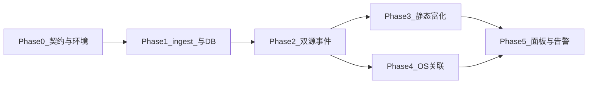

# 搭建 Paperboy 可观测性系统

> 创建日期：2026-03-28
> 更新日期：2026-03-30（增补可执行分阶段路线 §11.7）
> 作者：Xinyao Chen
> 状态：草案（Draft）
> 关联文档：[Paperboy 前端大重写方案](./paperboy-frontend-rewrite_zh-CN.md) — 第 4.2 节「可观测性 + 可靠性」

## 一、愿景

**任何错误都能被追溯到根因——自动地、带完整上下文、不需要问用户"你做了什么"。**

Paperboy 的可观测性系统不是又一个 Sentry 的翻版。它结合了三个自研工具，构成竞品无法复制的能力：

| 层                 | 工具                     | 提供什么                                              |
| ------------------ | ------------------------ | ----------------------------------------------------- |
| **运行时错误**     | ohbug（SDK + Dashboard） | 错误捕获、聚合、source map 反解、告警、session replay |
| **静态代码上下文** | kly                      | 文件级代码索引、依赖图、git 历史、LLM 生成的元数据    |
| **OS 级上下文**    | Paperboy OS 采集层       | 屏幕截图、按键、剪贴板、窗口切换、Accessibility Tree  |

当一个错误发生时，这三条数据流在云端汇聚，生成一份 **Enriched Error Report**，不仅告诉你**什么坏了**，还告诉你**为什么可能坏了**、**谁改的**、**影响有多大**、以及**用户在出错那一刻正在做什么**。

---

## 二、系统架构

```
┌─────────────────────────────────┐        ┌───────────────────────────────────┐
│   macOS 客户端（瘦客户端）        │        │            云端                    │
│                                  │        │                                    │
│  ┌────────────────────────────┐  │ 上报   │  ┌──────────────────────────────┐  │
│  │ OS 采集层 (Swift)           │──┼───────→│  │ OS 数据存储                   │  │
│  │ Accessibility / 截屏        │  │        │  │ 截图 / 按键 / 剪贴板 /        │  │
│  │ 按键 / 剪贴板               │  │        │  │ 窗口切换                     │  │
│  └────────────────────────────┘  │        │  └──────────────┬───────────────┘  │
│                                  │        │                 │                   │
│  ┌────────────────────────────┐  │        │  ┌──────────────▼───────────────┐  │
│  │ WebView (React SPA)         │  │  API   │  │  paperboy-platform          │  │
│  │                             │←─┼───────→│  │  ┌─────────────────────────┐ │  │
│  │ @ohbug/browser 捕获错误     │  │        │  │  │ KlyService              │ │  │
│  │ → 上报到云端               │──┼───────→│  │  │ enrichErrorStack()      │ │  │
│  │                             │  │        │  │  └─────────────────────────┘ │  │
│  │ Observability 面板          │  │        │  │  ohbug event 接收             │  │
│  │ (issues, metrics, alerts)   │  │        │  │  source map 反解              │  │
│  └────────────────────────────┘  │        │  │  告警评估                     │  │
│                                  │        │  └──────────────┬───────────────┘  │
│  ┌────────────────────────────┐  │        │                 │                   │
│  │ Native Shell (Swift)        │  │        │  ┌──────────────▼───────────────┐  │
│  │ 窗口 / 通知 / Orb           │  │        │  │ 可观测性数据库               │  │
│  └────────────────────────────┘  │        │  │ PostgreSQL + Redis + 文件    │  │
│                                  │        │  └──────────────────────────────┘  │
└─────────────────────────────────┘        └───────────────────────────────────┘
```

---

## 三、ohbug — 运行时错误监控

ohbug 是一个自托管的错误监控系统，由两个仓库组成：

- **ohbug**（`~/work/ohbug`）— SDK monorepo：客户端错误捕获、上报、扩展系统
- **ohbug-dashboard**（`~/work/ohbug-dashboard`）— 全栈 Dashboard：事件接收、聚合、可视化、告警

### 3.1 ohbug SDK 架构

SDK 是一个 pnpm monorepo，使用 Vite+（`vp pack`）构建，TypeScript，Apache-2.0 许可。

#### 包一览

| 包                              | 用途                                                                                     |
| ------------------------------- | ---------------------------------------------------------------------------------------- |
| **@ohbug/types**                | 共享 TypeScript 类型声明（`OhbugEvent`, `OhbugClient`, `OhbugExtension`, `OhbugConfig`） |
| **@ohbug/utils**                | 内部工具：`getGlobal`、`getOhbugObject`、logger、校验器、DOM 工具                        |
| **@ohbug/core**                 | Client 生命周期、事件创建、`notify` 上报链路、扩展编排、`EventTypes`                     |
| **@ohbug/browser**              | 浏览器 SDK：全局错误监听、XHR/Fetch/WebSocket monkey-patch、面包屑采集、HTTP 上报器      |
| **@ohbug/react**                | `OhbugErrorBoundary` — React Error Boundary，捕获渲染错误                                |
| **@ohbug/vue**                  | Vue 2/3 `config.errorHandler` 集成                                                       |
| **@ohbug/angular**              | Angular `ErrorHandler` provider factory                                                  |
| **@ohbug/cli**                  | Node CLI：交互式 source map 上传                                                         |
| **@ohbug/unplugin**             | 构建插件（Vite/Rollup/Webpack），自动上传 `.map` 文件                                    |
| **@ohbug/extension-rrweb**      | Session replay：rrweb `record`，将录制事件附加到 ohbug event metadata                    |
| **@ohbug/extension-web-vitals** | Core Web Vitals（FCP/LCP/CLS/FID）→ `category: "performance"` 事件                       |
| **@ohbug/extension-uuid**       | 匿名用户追踪（UUID）                                                                     |
| **@ohbug/extension-view**       | 页面可见性 + URL 变化追踪                                                                |
| **@ohbug/extension-feedback**   | 用户反馈 UI（Solid.js + Tailwind）                                                       |

#### 错误捕获链路

```
1. 初始化
   Ohbug.setup(config) → 创建 Client → 注册 OhbugBrowser 扩展
                                        → 安装捕获处理器

2. 捕获 → 分发 → 处理
   ┌─ window "error" 事件 ──────→ scriptDispatcher ──→ uncaughtErrorHandler
   ├─ window "unhandledrejection" ──────────────────→ unhandledrejectionHandler
   ├─ XHR monkey-patch ─────────→ networkDispatcher → ajaxErrorHandler
   ├─ fetch monkey-patch ───────→ networkDispatcher → fetchErrorHandler
   ├─ WebSocket monkey-patch ──→ networkDispatcher → websocketErrorHandler
   ├─ 资源加载失败 ─────────────→ scriptDispatcher ──→ resourceErrorHandler
   └─ React ErrorBoundary ──────────────────────────→ reactErrorHandler

3. 事件创建
   handler 构建 detail → client.createEvent({ category, type, detail })
   → handleEventCreated: reduce 链（config.onEvent → extensions.onEvent）
   → 任何一步返回 null 即丢弃事件

4. 上报
   client.notify(event)
   → browser notifier: POST JSON 到 config.endpoint
     （优先用 navigator.sendBeacon，降级为 XHR）
   → 执行 config + extensions 的 onNotify 钩子

5. 面包屑
   client.addAction() → 环形缓冲区（maxActions，默认 30）
   → 每个新事件都会携带 actions 数组
```

#### 核心类型定义

```typescript
interface OhbugEvent {
  apiKey: string;
  appVersion?: string;
  appType?: string;
  releaseStage?: string;
  timestamp: string;
  category: "error" | "message" | "feedback" | "view" | "performance" | "other";
  type: string; // EventTypes: UNCAUGHT_ERROR, RESOURCE_ERROR, AJAX_ERROR, FETCH_ERROR, WEBSOCKET_ERROR, REACT, VUE, ANGULAR, ...
  sdk: { platform: string; version: string };
  detail: unknown;
  device: OhbugDevice;
  user?: OhbugUser;
  actions?: OhbugAction[];
  metadata?: OhbugMetadata;
}

interface OhbugExtension {
  name: string;
  onSetup?(client: OhbugClient): void;
  onDestroy?(client: OhbugClient): void;
  onEvent?(event: OhbugEvent, client: OhbugClient): OhbugEvent | null;
  onNotify?(event: OhbugEvent, client: OhbugClient): void;
}

interface OhbugConfig {
  apiKey: string;
  endpoint: string;
  maxActions?: number; // 默认 30
  onEvent?(event: OhbugEvent): OhbugEvent | null;
  onNotify?(event: OhbugEvent): void;
  user?: OhbugUser;
  metadata?: OhbugMetadata;
  logger?: OhbugLogger;
}
```

#### Source Map 上传

SDK 提供两种 source map 上传机制：

1. **@ohbug/cli** — 交互式 CLI：`ohbug upload` 提示输入 API key，选择 `.map` 文件
2. **@ohbug/unplugin** — 构建插件：Vite/Rollup/Webpack 构建后自动上传 map 文件

两者都上传到 dashboard 的 `POST /sourceMap/upload` 接口，携带 `apiKey`、`appVersion` 和 map 文件。

### 3.2 ohbug-dashboard 架构

Dashboard 是一个全栈应用，在 `feature/shadcn` 分支上（比 `main` 领先 23 个 commit），已迁移到现代技术栈：

#### 技术栈

| 层            | 技术                                                                                                     |
| ------------- | -------------------------------------------------------------------------------------------------------- |
| Web UI        | Vite + TanStack Start + TanStack Router, React 19, Nitro (SSR), Tailwind CSS v4, TanStack Query, Zustand |
| Dashboard API | oRPC（`@orpc/server` / `@orpc/client`），走 `/api/rpc`                                                   |
| 认证          | Better Auth + Drizzle adapter                                                                            |
| 事件接收服务  | Hono + @hono/node-server（端口 6660）                                                                    |
| 任务队列      | BullMQ + Redis                                                                                           |
| 数据库        | PostgreSQL + Drizzle ORM                                                                                 |
| Source Map    | source-map-trace                                                                                         |

#### 数据库 Schema（Drizzle）

| 领域         | 表                                                                                          |
| ------------ | ------------------------------------------------------------------------------------------- |
| 认证         | `user`, `session`, `account`, `verification`（Better Auth）                                 |
| 项目         | `project`, `users_on_projects`                                                              |
| Issue / 事件 | `issue`, `event`, `event_user`, `event_users_on_issues`, `event_users_on_projects`          |
| 指标         | `metric`, `feedback`, `page_view`, `user_view`                                              |
| 告警         | `alert`（conditions/filters/actions 为 JSON，级别：serious/warning/default），`alert_event` |
| 发布         | `release`，`sourceMaps` JSONB 列                                                            |

#### 接收链路

```
SDK POST → Hono /
  │
  ├─ category: "error"  → BullMQ "document" 队列（3s 延迟）
  │                         → event.worker: 持久化事件 → upsert issue
  │                           → 聚合计数 → 可能入队 "alert"
  │
  ├─ category: "performance" → metric 任务
  ├─ category: "feedback"    → feedback 任务
  ├─ category: "view"        → pageView / userView 任务
  │
  └─ alert.worker: 评估规则 → 发送 email/webhook → alert_event 记录

Source Map 上传：
  POST /sourceMap/upload → BullMQ "sourceMap" 队列
    → source-map.worker: upsert release → 存储文件到 .uploads/
    → 每个 release 最多 5000 个 map（FIFO 淘汰）
```

#### Dashboard 页面

| 路由               | 功能                                                                 |
| ------------------ | -------------------------------------------------------------------- |
| `/issues`          | Issue 列表：按 Last seen / First seen / Events / Users 排序          |
| `/issues/$issueId` | Issue 详情：24h/14d 趋势条、最新事件 detail、source map 反解后的堆栈 |
| `/feedbacks`       | 用户反馈列表 + 详情                                                  |
| `/alerts`          | 告警规则：创建/编辑/删除，事件趋势                                   |
| `/metrics`         | 性能指标                                                             |
| `/releases`        | 发布列表，每个发布的 source map                                      |
| `/users`           | 受影响的用户                                                         |
| `/settings`        | 项目设置                                                             |

#### Source Map 反解

1. SDK 或 CLI 上传 `.map` 文件到 `POST /sourceMap/upload`，携带 `apiKey` + `appVersion`
2. Dashboard 将文件存储到磁盘（`.uploads/`），元数据存入 `release.sourceMaps` JSONB
3. 查看事件时，`event.get` oRPC 过程使用 `source-map-trace` 根据匹配的 release source map 反解堆栈帧
4. 反解后的源码位置与原始堆栈一并展示

### 3.3 ohbug 接入 Paperboy 的计划

#### 直接使用的包

| 包                            | 集成方式                                       |
| ----------------------------- | ---------------------------------------------- |
| `@ohbug/browser`              | `npm install` 到 React SPA，捕获所有运行时错误 |
| `@ohbug/react`                | `OhbugErrorBoundary` 包裹顶层组件              |
| `@ohbug/extension-rrweb`      | Session replay 录制                            |
| `@ohbug/extension-web-vitals` | Core Web Vitals 监控                           |
| `@ohbug/unplugin`             | 构建时自动上传 source map                      |

#### 需要新增的

| 组件               | 说明                                                                                                           |
| ------------------ | -------------------------------------------------------------------------------------------------------------- |
| `@ohbug/webview`   | 新扩展：捕获 WebView bridge 错误（Swift↔WebView 通信失败、bridge 超时）                                        |
| Dashboard 组件提取 | 从 ohbug-dashboard 提取 issue 列表、issue 详情、趋势图、告警管理为可嵌入的 React 组件，用于 Observability 面板 |
| Santi 作为接收后端 | 将 ohbug 事件通过 Santi API 路由，而非独立的 Hono 服务，使云端能用 kly + OS 上下文做富化                       |

---

## 四、kly — 静态代码上下文

kly（`~/work/kly`）是一个代码仓库文件级索引工具，通过 tree-sitter AST 解析代码结构，用 LLM 生成人类可读的文件元数据，存储在 per-branch SQLite 数据库中。

### 4.1 现有能力（v0.2）

> kly v0.2 是 **agent-first** 设计：所有 CLI 命令默认输出 JSON（`--pretty` 可切换人类可读格式）。MCP 支持已移除 — kly 现在是**库**（直接 `import from "kly"`）+ **CLI 工具**。

| 能力                      | 状态 | 说明                                                                                                    |
| ------------------------- | ---- | ------------------------------------------------------------------------------------------------------- |
| Tree-sitter AST 解析      | ✅   | TypeScript / JavaScript / Swift                                                                         |
| LLM 文件元数据生成        | ✅   | 文件描述、summary、symbol 描述                                                                          |
| Git-aware 增量构建        | ✅   | per-branch SQLite，只重新索引变更文件                                                                   |
| FTS5 全文搜索             | ✅   | BM25 排序 + 可选 LLM rerank                                                                             |
| dependency graph + 依赖表 | ✅   | 文件级 `dependencies` 表，`from_path`/`to_path`，已建索引支持快速反向查询                               |
| `getDependents()`         | ✅   | 查询所有 import 了指定文件的文件（反向依赖）                                                            |
| `getFileHistory()`        | ✅   | 查询指定文件的 git commit 历史                                                                          |
| `enrichErrorStack()`      | ✅   | 用代码上下文 + 依赖 + git 历史丰富 error stack                                                          |
| CLI                       | ✅   | 11 个命令：`init`/`build`/`query`/`show`/`overview`/`graph`/`dependents`/`history`/`enrich`/`hook`/`gc` |

### 4.2 核心类型定义

```typescript
interface FileIndex {
  path: string;
  name: string; // LLM 生成的文件名称
  description: string; // LLM 生成的文件描述
  language: Language; // typescript | javascript | swift
  imports: string[];
  exports: string[];
  symbols: SymbolInfo[]; // 函数/类/接口/类型/枚举/变量
  summary: string; // LLM 生成的文件摘要
  hash: string;
  indexedAt: number;
}

interface SymbolInfo {
  name: string;
  kind: SymbolKind; // class | function | method | interface | type | enum | variable | protocol | struct
  description: string;
}

interface DependencyGraph {
  nodes: Map<string, GraphNode>;
  edges: GraphEdge[]; // { from, to }
}
```

### 4.3 库导出

kly 已经是一个导出干净的 TypeScript 库（`src/index.ts`）：

- `IndexDatabase` — SQLite 数据库操作（CRUD、搜索）
- `buildIndex()` — 构建/增量更新索引
- `searchFiles()` / `searchFilesWithRerank()` — 搜索
- `buildDependencyGraph()` / `generateMermaid()` — 依赖图
- `scanFiles()` — 文件扫描
- `ParserManager` — tree-sitter 解析管理
- `LLMService` — LLM 调用
- Git 工具函数（`getCurrentBranch`、`getChangedFiles` 等）
- Store 函数（`openDatabase`、`loadState` 等）

### 4.4 已知问题

| 问题                        | 严重度 | 说明                                                                         |
| --------------------------- | ------ | ---------------------------------------------------------------------------- |
| `better-sqlite3` ABI 不兼容 | 🔴     | Node v24 binary vs vite-plus Node v25 wrapper。Santi 用 Bun 运行可自动解决。 |
| LLM provider 错误处理粗糙   | 🟡     | 无效 API key 报 "Unexpected end of JSON input"，应该报清晰错误。             |
| 依赖图只解析相对路径 import | 🟡     | 不追踪 `node_modules` 包导入、动态 import、re-export。                       |

---

## 五、交汇点 — `enrich_error_stack`

这是 ohbug 的运行时数据与 kly 的静态代码上下文相遇的核心集成点。ohbug 捕获的 error stack 通过 kly 获得完整的代码上下文。

### 5.1 对比：有 kly 和没有 kly

**没有 kly（传统模式）：**

```
TypeError: Cannot read property 'content' of undefined
    at renderMessage (MessageList.tsx:142)
    at Array.map (<anonymous>)
    at ChatPanel (ChatPanel.tsx:87)
```

→ 你只知道 142 行炸了。然后人工翻代码、人工判断影响范围。

**kly + ohbug 结合后（目标模式）：**

```
TypeError: Cannot read property 'content' of undefined
    at renderMessage (MessageList.tsx:142)

    ┌─ kly: MessageList.tsx
    │  描述: Chat 消息列表渲染组件，处理 streaming/markdown/attachment
    │  symbols: renderMessage(), useScrollPosition(), MessageBubble
    │  imports from: ChatStore, MessageTypes, MarkdownRenderer
    │  imported by: ChatPanel, WorkspaceChat, DetachedChatWindow (5个消费者)
    │
    │  风险传播路径: ChatPanel.tsx → WorkspaceRoot.tsx → App.tsx
    │  近30天此文件错误: 3次 (高频模块)
    │  最近修改: commit abc1234 by @yanan-li (3天前, PR #236)
    └─
```

### 5.2 函数签名

```typescript
interface EnrichedFrame {
  file: string;
  line: number;
  column?: number;
  function?: string;

  // kly index enrichment
  fileDescription: string;
  fileSummary: string;
  symbols: SymbolInfo[];
  language: Language;

  // kly graph enrichment
  importedBy: string[]; // 反向依赖
  importsFrom: string[]; // 正向依赖
  riskPropagation: string[]; // BFS 展开路径

  // git enrichment
  lastModified: GitCommit | null;
  recentCommits: GitCommit[];
}

interface EnrichedErrorStack {
  originalStack: string;
  frames: EnrichedFrame[];
  affectedModules: number;
  riskLevel: "low" | "medium" | "high" | "critical";
}

export function enrichErrorStack(
  db: IndexDatabase,
  root: string,
  stack: string | ErrorFrame[],
): EnrichedErrorStack;
```

### 5.3 实现流程

```
输入: error stack (string 或 parsed frames)
  │
  ├── 1. 解析 stack trace → 提取 file + line + function
  │      (如果输入是 string，用 error-stack-parser 解析)
  │
  ├── 2. 对每个 frame:
  │      ├── db.getFile(frame.file)         → 文件描述、symbols、summary
  │      ├── getDependents(db, frame.file)  → 反向依赖
  │      ├── graph.buildDependencyGraph()   → 风险传播路径
  │      └── getFileHistory(root, frame.file) → 最近修改
  │
  ├── 3. 计算 riskLevel:
  │      ├── 依赖扇出 > 10 → +1 level
  │      ├── 最近 7 天内有修改 → +1 level
  │      ├── 历史错误次数 > 3（需要 ohbug 数据） → +1 level
  │      └── low(0) / medium(1) / high(2) / critical(3)
  │
  └── 4. 组装 EnrichedErrorStack 返回
```

### 5.4 kly 使用的 API（已在 v0.2 中实现）

> 以下所有 API 已在 kly v0.2 中实现并导出。enrichment 管线不需要额外的 kly 开发工作。

**`getDependents()` — 反向依赖查询：**

```typescript
export function getDependents(db: IndexDatabase, filePath: string): string[] {
  // 使用 `dependencies` 表进行快速索引查找
  // SELECT from_path FROM dependencies WHERE to_path = ?
}
```

**`getFileHistory()` — Git 历史查询：**

```typescript
interface GitCommit {
  hash: string;
  author: string;
  email: string;
  date: number;
  message: string;
}

export function getFileHistory(root: string, filePath: string, limit?: number): GitCommit[];
```

**`dependencies` 表（索引构建时自动写入）：**

```sql
CREATE TABLE IF NOT EXISTS dependencies (
  from_path TEXT NOT NULL,
  to_path TEXT NOT NULL,
  PRIMARY KEY (from_path, to_path)
);

CREATE INDEX IF NOT EXISTS idx_deps_to ON dependencies(to_path);
-- 反向查询：SELECT from_path FROM dependencies WHERE to_path = ?
```

**CLI 等效命令：**

```bash
kly dependents <path>     # 查询反向依赖
kly history <path>        # 查询文件 git 历史
kly enrich --frames '...' # 丰富 error stack frames（JSON 输入/输出）
kly graph --focus <path>  # 指定文件的依赖图
```

---

## 六、Santi 集成 — 编排层

**命名说明**：本节描述的是**云端编排职责**（连接 kly、类 ohbug 事件、OS 上下文）。工程落点以 **paperboy-platform** 为准（见**第十一节**）。**macOS Santi 守护进程**负责 WebSocket 桥与 OS 采集，与云端「编排服务」同名不同层：客户端传数据上来，云端聚合并富化。

编排层以库的方式导入 kly（在运行环境允许时），通过 API 接收浏览器/服务端的错误事件，并用时间戳与 session 等关联 OS 上下文。

### 6.1 KlyService

```typescript
// packages/santi/src/observability/kly-service.ts
import {
  openDatabase,
  searchFiles,
  buildDependencyGraph,
  enrichErrorStack,
  getDependents,
  getFileHistory,
  buildIndex,
} from "kly";

export class KlyService {
  private repoRoot: string;

  constructor(repoRoot: string) {
    this.repoRoot = repoRoot;
  }

  enrichError(errorStack: string): EnrichedErrorStack {
    const db = openDatabase(this.repoRoot);
    try {
      return enrichErrorStack(db, this.repoRoot, errorStack);
    } finally {
      db.close();
    }
  }

  getFileInfo(filePath: string) {
    const db = openDatabase(this.repoRoot);
    try {
      return {
        index: db.getFile(filePath),
        dependents: getDependents(db, filePath),
        history: getFileHistory(this.repoRoot, filePath),
      };
    } finally {
      db.close();
    }
  }

  async rebuildIndex() {
    await buildIndex(this.repoRoot, { incremental: true });
  }
}
```

### 6.2 接入方式

```
Santi 直接 import kly 库函数  ←  主要方式（零协议开销）
     │
     │  同时
     │
kly CLI（JSON 输出）  ←  给 CI、脚本和 agent 工具使用
```

选择直接 import 的理由：

- kly 已经是一个导出干净的 TypeScript 库
- Santi 和 kly 都是 TypeScript，类型自然共享
- 不需要多跑一个进程，不需要协议开销
- kly v0.2 CLI 默认输出 JSON，任何 agent 都可通过 shell 调用

---

## 七、端到端数据流

```
┌────────────────────────────┐
│ Paperboy WebView (React)   │
│                             │
│ @ohbug/browser 捕获 error   │
│ + error-stack-parser 解析   │
└──────────────┬──────────────┘
               │ 上报 error event
               │ (stack trace + source map 后的文件名/行号)
               ▼
┌──────────────────────────────────────────────────┐
│ paperboy-platform（云端 API）                     │
│                                                   │
│  1. 接收 ohbug error event                        │
│                                                   │
│  2. Source map 反解（实现可选用 source-map 等）    │
│     → 解析到源码行                                 │
│                                                   │
│  3. enrichErrorStack() / KlyService 等价实现        │
│     ├── db.getFile()         → 文件描述/symbols   │
│     ├── getDependents()      → 反向依赖           │
│     ├── buildDependencyGraph() → 风险传播路径      │
│     └── getFileHistory()     → git 修改记录       │
│                                                   │
│  4. 合并 OS 上下文（通过时间戳关联）               │
│     ├── 报错时刻的屏幕截图                        │
│     ├── 用户操作轨迹（鼠标/键盘/窗口切换）         │
│     └── 剪贴板内容                                │
│                                                   │
│  5. 生成 Enriched Error Report                    │
│     → 存入平台 PostgreSQL（或并存 ohbug-dashboard）│
│     → 推送到 Observability 面板                    │
│     → 自动生成 Markdown 文档                       │
│     → 可选：自动创建 Linear issue                  │
└──────────────┬───────────────────────────────────┘
               │
               ▼
┌──────────────────────────────────────────────────┐
│ Observability 面板 (React)                        │
│                                                   │
│  ┌──────────────────────────────────────────────┐ │
│  │ Enriched Error View                          │ │
│  │                                              │ │
│  │ TypeError: Cannot read 'content' of undefined│ │
│  │ at renderMessage (MessageList.tsx:142)        │ │
│  │                                              │ │
│  │ MessageList.tsx                               │ │
│  │    Chat 消息列表渲染组件                      │ │
│  │    5 个模块依赖此文件                         │ │
│  │    最近修改: @yanan-li, 3天前, PR #236        │ │
│  │                                              │ │
│  │ 用户当时的屏幕                                │ │
│  │    [截图]                                    │ │
│  │                                              │ │
│  │ 操作时间线                                    │ │
│  │    15:42:01 Chrome 复制代码                   │ │
│  │    15:42:03 切换到 Paperboy                   │ │
│  │    15:42:05 粘贴到输入框                      │ │
│  │    15:42:06 点击发送                          │ │
│  │    15:42:08 ERROR                            │ │
│  └──────────────────────────────────────────────┘ │
└──────────────────────────────────────────────────┘
```

---

## 八、竞争优势 — 为什么只有 Paperboy 能做到

| 数据维度            | Sentry         | Paperboy                                         |
| ------------------- | -------------- | ------------------------------------------------ |
| Error Stack         | ✅             | ✅（ohbug + source map → commit/行）             |
| Session Replay      | rrweb DOM 模拟 | ✅ **OS 级真实截屏**（不是模拟，是事实）         |
| 用户操作轨迹        | 页面内点击     | ✅ **全 OS 操作**（鼠标/键盘/窗口切换/app 切换） |
| 剪贴板内容          | ❌             | ✅ 用户复制粘贴了什么                            |
| 跨应用上下文        | ❌             | ✅ 用户从哪个 app 切过来的                       |
| UI 状态树           | ❌             | ✅ Accessibility Tree 完整快照                   |
| 代码结构 / 依赖图   | ❌             | ✅ kly file index + dependency graph             |
| git blame / PR 关联 | 需手动配置     | ✅ kly 自动关联                                  |

**具体场景示例：**

```
15:42:01  用户在 Chrome 里复制了一段代码         ← OS: clipboard event
15:42:03  用户切换到 Paperboy                    ← OS: window switch
15:42:05  用户粘贴到 chat 输入框                 ← OS: keystroke ⌘V
15:42:06  用户点击发送                           ← OS: mouse click
15:42:07  [截屏] 用户看到的完整界面               ← OS: screenshot
15:42:08  TypeError: Cannot read 'content'        ← ohbug: error event
           at MessageList.tsx:142

           ┌─ kly enrichment:
           │  MessageList.tsx 3天前被 @yanan-li 改过 (PR #236)
           │  imports from: ChatStore (数据源)
           │  imported by: 5 个消费者
           └─
```

→ 不需要问用户"请描述你的操作步骤"。系统已经全部知道了。

---

## 九、Observability 面板功能

Observability 面板是 Paperboy React SPA 内嵌的一个 tab，结合了 ohbug-dashboard 组件、kly enrichment 和 OS 上下文。

### 9.1 核心视图

| 视图           | 来源                  | 说明                                                        |
| -------------- | --------------------- | ----------------------------------------------------------- |
| Issue 列表     | ohbug-dashboard       | 聚合后的 issue，含发生次数、受影响用户数、趋势              |
| Issue 详情     | ohbug-dashboard + kly | Error stack + kly 富化、source map 反解的代码、依赖图       |
| Session Replay | rrweb + OS 截图       | DOM 录制 + 出错时刻的真实 OS 截屏                           |
| 操作时间线     | OS 采集层             | 导致错误的用户操作按时间排列                                |
| 风险热力图     | kly 依赖图            | 依赖扇出可视化，高亮高风险模块                              |
| 趋势图表       | ohbug-dashboard       | 错误率趋势（日/周对比）、性能指标                           |
| 告警管理       | ohbug-dashboard       | 配置告警规则、通知渠道                                      |
| 每日健康报告   | ohbug + kly           | 自动生成：新增/关闭 issue、错误率趋势、受影响用户、性能指标 |

### 9.2 自动化工作流

| 触发                       | 动作                                                                    |
| -------------------------- | ----------------------------------------------------------------------- |
| 新 ohbug issue 创建        | 自动生成 Markdown 文档（错误摘要、堆栈、影响范围、复现步骤、commit/PR） |
| 高依赖模块出错             | 自动提升优先级，通知负责的开发者                                        |
| Slack #bugs 消息           | 统一入口 → 关联 ohbug 事件 → 自动分配                                   |
| Linear / GitHub issue      | Webhook → Santi API → 关联 ohbug issue                                  |
| PR 提交（MiniChen review） | kly 库 API 查询变更文件 → 依赖图 → 标注受影响模块                       |

---

## 十、行动计划

> **按顺序落地请优先遵循 [§11.7 可执行落地路线](#117-可执行落地路线分阶段)**：下列表格按「工具/模块」归类，§11.7 按「阶段与验收」排序，二者对照使用。

### 第一步：kly 核心改造

> **状态：大部分已在 kly v0.2 中完成**（commit `b819ff2`，2026-03-28）。

| 序号 | 任务                                | 优先级 | 状态                           |
| ---- | ----------------------------------- | ------ | ------------------------------ |
| 1    | 新增 `getDependents()` API + 导出   | 🔴 高  | ✅ v0.2 已完成                 |
| 2    | 新增 `getFileHistory()` API + 导出  | 🔴 高  | ✅ v0.2 已完成                 |
| 3    | 新增 `dependencies` 表 + 构建时写入 | 🟡 中  | ✅ v0.2 已完成                 |
| 4    | 新增 `enrichErrorStack()` + 导出    | 🔴 高  | ✅ v0.2 已完成                 |
| 5    | ~~MCP 新增 4 个 tool~~              | ~~🟡~~ | ❌ 取消 — MCP 已在 v0.2 中移除 |
| 6    | 修复 LLM provider 错误处理          | 🟢 低  | 待完成                         |

### 第二步：ohbug 增强

| 序号 | 任务                                          | 优先级 | 工作量 |
| ---- | --------------------------------------------- | ------ | ------ |
| 1    | 创建 `@ohbug/webview` 扩展（bridge 错误捕获） | 🔴 高  | 中     |
| 2    | 从 dashboard 提取可嵌入的组件包               | 🔴 高  | 大     |
| 3    | 在 Paperboy React SPA 中集成 rrweb 扩展       | 🟡 中  | 小     |
| 4    | 集成 web-vitals 扩展                          | 🟡 中  | 小     |
| 5    | 配置 unplugin 自动上传 source map             | 🟡 中  | 小     |

### 第三步：云端编排（paperboy-platform）

> 云端接收、存储、富化编排以 **paperboy-platform** 为落点；本地 macOS **Santi 守护进程**负责桥接与 OS 采集。详见**第十一节**。

| 序号 | 任务                                         | 优先级 | 工作量 |
| ---- | -------------------------------------------- | ------ | ------ |
| 1    | paperboy-platform 集成 `kly`（可选依赖）     | 🔴 高  | —      |
| 2    | 实现 `KlyService` 或等价封装层               | 🔴 高  | 中     |
| 3    | ohbug 类 event → `enrichErrorStack()` 调用链 | 🔴 高  | 中     |
| 4    | Enriched Error Report → 存储 + 推送到前端    | 🔴 高  | 中     |
| 5    | 合并 OS 上下文（截屏 + 操作轨迹）            | 🟡 中  | 中     |
| 6    | 类 ohbug 接收与 issue 模型迁入 platform API  | 🟡 中  | 大     |

### 第四步：CI 集成

| 序号 | 任务                                                   | 优先级 | 工作量                        |
| ---- | ------------------------------------------------------ | ------ | ----------------------------- |
| 1    | GitHub Actions：每次 push 跑 `kly build --incremental` | 🟡 中  | 小                            |
| 2    | 上传 index DB 到云端存储                               | 🟡 中  | 小                            |
| 3    | post-commit hook 自动更新本地索引                      | 🟢 低  | 小（已有 `kly hook install`） |

### 第五步：Observability 面板

| 序号 | 任务                                         | 优先级 | 工作量 |
| ---- | -------------------------------------------- | ------ | ------ |
| 1    | Issue 列表 + 详情视图                        | 🔴 高  | 中     |
| 2    | Enriched error stack 视图                    | 🔴 高  | 中     |
| 3    | 操作时间线 + OS 截图视图                     | 🔴 高  | 中     |
| 4    | 风险热力图 / 依赖可视化                      | 🟡 中  | 中     |
| 5    | 告警管理 UI                                  | 🟡 中  | 小     |
| 6    | 每日健康报告自动生成                         | 🟡 中  | 中     |
| 7    | 统一入口（Slack + Linear + GitHub webhooks） | 🟢 低  | 大     |

---

## 十一、paperboy-platform 集成

**落地顺序**：请先按下面 **[§11.7 可执行落地路线](#117-可执行落地路线分阶段)** 分阶段执行；§11.1～§11.6 说明「是什么、为什么」。

云端侧的**事件枢纽**是 **paperboy-platform**（`~/work/paperboy-platform`）：Bun + Hono 服务，已提供 REST、WebSocket（Santi 桥、访客聊天）、`storeError()` → `platform_errors`、OTEL 接入、Prometheus/Loki，以及 **web-chat-react** SPA。上文中的「云端 Santi 后端」在具体实现上对应为：**接收、存储、关联与 API 均在 paperboy-platform 内完成**。

设计与环境约定见上文；**§11.7** 给出按顺序可执行的分阶段路线（交付物 + 验收标准）。实现细节与代码进度以各仓库为准。

### 11.1 架构对齐

| 职责                                                     | 落点                                                                                                                            |
| -------------------------------------------------------- | ------------------------------------------------------------------------------------------------------------------------------- |
| 类 ohbug 事件 POST、issue 存储、source map、kly 索引文件 | **paperboy-platform**（规划路径 `/api/v1/observability/*`）                                                                     |
| kly 索引**构建**（tree-sitter + LLM）                    | **开发机 / CI**；构建出的 SQLite 上传到平台（或对象存储 + 热加载）                                                              |
| kly **富化**（处理/读取时）                              | **paperboy-platform** 在可用时加载 kly 索引；若运行环境未集成 `kly`，可跳过富化（运行时数据仍应落库）                           |
| OS 上下文（截屏、按键、剪贴板、窗口切换）                | **macOS Santi 守护进程** → **已有** WebSocket `/api/v1/web-chat/bridge/connect` 的 `os:*` 消息类型 → 持久化为可查询的 OS 事件行 |
| 服务端代理/计费错误                                      | **统一管线（目标）**：`storeError()` 与 WebView 错误进入同一 issue 模型，避免「前端一套、后端另一套」                           |
| 面板实时更新                                             | **WebSocket**（规划：`/api/v1/observability/ws`，管理员鉴权订阅者）                                                             |

### 11.2 更新后的云端示意图（概念）

```
macOS 客户端                          paperboy-platform（云端）
────────────────                      ───────────────────────────
WebView（React）                      POST …/observability/events（类 ohbug 载荷）
  @ohbug/browser 或等价 SDK      ──►  + PostgreSQL（events、issues、OS 行等）
  Observability 面板 WS            ◄──  WS …/observability/ws

Santi 守护进程（Swift）                WS /api/v1/web-chat/bridge/connect
  OS 采集层                        ──►  os:screenshot | os:keystroke | ...

CI / 开发机                           上传 kly 索引 + source map（内部鉴权）
  kly build --incremental          ──►  供富化与堆栈反解使用
```

### 11.3 混合 kly 模型

- **构建**在本地或 CI；**上传** SQLite（及可选元数据）到平台。
- 平台**不在**热路径上执行 `kly build`；在具备索引与 `KLY_REPO_ROOT` 等配置时，**可选**调用 `enrichErrorStack()` 做静态富化。

### 11.4 统一管线 + 两阶段呈现（最快可感知）

- **客户端**错误与**服务端** `storeError` **目标**是共用同一套 issue / event 模型。
- **快路径**：接收事件 → 解析堆栈 → fingerprint → 落库 → **尽快 WebSocket 推送**「原始事件」（堆栈可先未反解或未 kly 富化）。
- **慢路径**（异步）：source map 解析、可选 kly 富化、按时间窗关联 OS → **第二次推送**增量字段；面板应先渲染原始错误，再原位补上静态/OS 上下文，从而**最快看到「出事点」**，再逐步变全。

### 11.5 环境变量约定（paperboy-platform）

| 变量                               | 用途                                                      |
| ---------------------------------- | --------------------------------------------------------- |
| `OBSERVABILITY_INGEST_API_KEY`     | 浏览器 SDK 在事件体里携带的 `apiKey`（与 ohbug 字段兼容） |
| `KLY_INDEX_PATH` / `KLY_REPO_ROOT` | 可选：kly 富化所需路径与仓库根                            |
| `INTERNAL_SERVICE_KEY`             | 已有：内部上传（kly 索引等）可用 `Authorization: Bearer`  |

### 11.6 一次异常如何同时看到「运行时 + 静态 + OS」

**目标**：看到一条 issue 时，能同时回答三件事——**运行态**发生了什么、对应**源码与依赖/历史**是什么、**操作系统侧**当时在干什么——而尽量不靠用户口头复述操作步骤。

**三层数据与来源**

| 层次               | 典型内容                                                       | 主要来源                                                                                            |
| ------------------ | -------------------------------------------------------------- | --------------------------------------------------------------------------------------------------- |
| **运行时**         | 类型、消息、堆栈、source map 还原后的位置、（可选）网络/面包屑 | WebView：ohbug 或等价 SDK；服务端：代理/实时等路径上的 `storeError` 进入同一管线                    |
| **静态代码上下文** | 文件说明、符号、反向依赖、风险传播、最近 commit                | **kly**；索引在 CI/本机构建后上传到云端，由富化步骤读取                                             |
| **OS 级上下文**    | 截屏、按键、剪贴板、窗口切换、（可选）无障碍树                 | **macOS Santi**；经 **现有** WebSocket 桥上报；与错误用 **时间戳 + sessionId（或等价关联键）** 对齐 |

**与 paperboy-platform 已有能力的关系（文档层对齐）**

- **已有**：`platform_errors` + `storeError`、OTEL 摄入（Opik / Prometheus / Loki）、`/internal/metrics`、web-chat-react、Santi / 访客 WebSocket。
- **约定**：可观测性 **issue 级叙事**（Enriched Error Report）以「统一事件模型」为产品目标；**OTEL / Loki** 继续承担追踪与日志检索。是否在存储层自动把 trace/log 与 issue 关联，留到实现阶段再定；排障时至少应能通过 `requestId`、`userId`、时间范围人工串联。

**「最快观测到问题出现的地方」— 产品与协议要点**

1. **先定位运行态**：堆栈 +（如有）source map 行号，是第一屏必须有的信息。
2. **再叠加静态**：kly 富化异步到达后，在同一 issue 上展示依赖/历史，回答「改坏概率高的文件是谁」。
3. **再叠加 OS**：同一时间窗内的 OS 时间线回答「用户当时在哪个 App、点了什么、剪贴板里有什么」。
4. **关联键**：尽量统一 **sessionId**（或设备侧 session）贯穿 WebView、Santi、服务端可选头；OS 与错误事件的默认关联采用 **±N 秒滑动时间窗**（N 在实现时固化，文档建议从 5s 量级起步）。

### 11.7 可执行落地路线（分阶段）

本节是**按依赖排序的执行清单**：完成上一阶段「验收标准」后再进入下一阶段，避免先做面板却无数据、或先接 OS 却无事件可关联。

#### 11.7.1 依赖顺序（必读）



- **Phase 1** 产出「可写入、可查询」的事件与 issue，是一切的前提。
- **Phase 2** 把 **WebView** 与 **`storeError`** 打进同一模型（你要求的「一次异常看全栈」才有数据基础）。
- **Phase 3、4** 可部分并行，但 **OS 关联（Phase 4）** 依赖 **Phase 2** 里已有带时间的 event。
- **Phase 5** 依赖前面至少有 **GET 列表/详情**（可在 Phase 1 末尾用最小只读 API 代替完整面板）。

#### 11.7.2 阶段总览

| 阶段        | 目标（一句话）                                                      | 主要仓库                                                   | 预计体量（单人粗估） |
| ----------- | ------------------------------------------------------------------- | ---------------------------------------------------------- | -------------------- |
| **Phase 0** | 冻结字段、环境、路径，避免返工                                      | mybrain 文档 + 各 repo `.env.example`                      | 0.5～1 天            |
| **Phase 1** | 云端能收事件、落库、按 fingerprint 聚合成 issue、可 HTTP 查询       | `paperboy-platform`                                        | 3～5 天              |
| **Phase 2** | Web 端上报 + 服务端 `storeError` 走同一管线；可选管理端 WS 推送 raw | `paperboy-platform` + `web-chat-react`                     | 2～4 天              |
| **Phase 3** | source map 上传与反解；kly 索引上传与 `enrichErrorStack` 异步富化   | `paperboy-platform` + CI + `kly`                           | 3～6 天              |
| **Phase 4** | Santi 桥扩展 `os:*` 持久化；与 event 按时间窗 + session 关联        | `paperboy`（Swift）+ `paperboy-platform`                   | 3～7 天              |
| **Phase 5** | Observability 面板（列表/详情/时间线）；告警与外链可后置            | `web-chat-react` 或 Paperboy WebView + `paperboy-platform` | 5～10+ 天            |

---

#### Phase 0 — 契约与环境（先做）

| 步骤 | 动作                                                                                                                                                                                           | 交付物                      | 验收标准                         |
| ---- | ---------------------------------------------------------------------------------------------------------------------------------------------------------------------------------------------- | --------------------------- | -------------------------------- |
| 0.1  | 在 `paperboy-platform` 文档或 `README` 中列出观测相关 env：`OBSERVABILITY_INGEST_API_KEY`、`INTERNAL_SERVICE_KEY`、`KLY_REPO_ROOT`、`KLY_INDEX_PATH`（可选）、`OBSERVABILITY_DATA_DIR`（可选） | 环境变量表与说明            | 新同事仅凭文档能配齐本地/Staging |
| 0.2  | 冻结 **ohbug 兼容** 的最小事件 JSON 形状（至少含：`apiKey`、`category`、`type`、`message` 或 `detail` 内可解析栈、`timestamp`、`appVersion`、`device`、`sessionId` 可选）                      | 文档片段或 JSON Schema 草稿 | 前后端对「第一版 payload」无歧义 |
| 0.3  | 冻结 **fingerprint** 规则（例如：`hash(type + normalizedMessage + topFrameFile:line)`）                                                                                                        | 一句话规则 + 示例           | 同一错误多次上报得到同一 issue   |
| 0.4  | 冻结 **OS 消息** `os:*` 字段（`type`、`timestamp`、`sessionId?`、`payload`）                                                                                                                   | 协议表                      | Swift 与 Hono 可各自实现         |

**完成标志**：0.1～0.4 写入仓库（或本文档附录 D）并已评审。

---

#### Phase 1 — paperboy-platform：最小 ingest + 库表 + 查询（MVP）

| 步骤 | 动作                                                                                                                                                                                       | 交付物                  | 验收标准                                       |
| ---- | ------------------------------------------------------------------------------------------------------------------------------------------------------------------------------------------ | ----------------------- | ---------------------------------------------- |
| 1.1  | Drizzle（或等价）新增 `observability_issues`、`observability_events`；迁移可在空库上 `migrate` 成功                                                                                        | SQL 迁移 + schema       | CI / 本地迁移无报错                            |
| 1.2  | `POST /api/v1/observability/events`：校验 `apiKey`==`OBSERVABILITY_INGEST_API_KEY`；解析栈字符串（可先用正则 + `error-stack-parser`）；算 fingerprint；**upsert issue** + **insert event** | 路由 + service          | `curl` 伪造一条 error，DB 里 1 issue + 1 event |
| 1.3  | `GET /api/v1/observability/issues`（管理员 JWT 或现有 admin 中间件）：分页、按 `lastSeen` 排序                                                                                             | 路由                    | 返回上一步写入的 issue                         |
| 1.4  | `GET /api/v1/observability/issues/:id`：含最近 N 条 events                                                                                                                                 | 路由                    | 详情与列表 id 一致                             |
| 1.5  | （可选本阶段）`POST` 返回 200 后 **异步** 写 `enriched_stack=null`，仅占位                                                                                                                 | 队列或 `queueMicrotask` | 不阻塞 SDK 上报                                |
| 1.6  | 日志：ingest 失败打结构化日志（勿打 apiKey）                                                                                                                                               | logger                  | 排障时可 grep                                  |

**完成标志**：无前端也能用 HTTP 完成「上报 → 库里有 → API 能查」。

---

#### Phase 2 — 双源运行时：web-chat + `storeError`

| 步骤 | 动作                                                                                                                                    | 交付物                              | 验收标准                                               |
| ---- | --------------------------------------------------------------------------------------------------------------------------------------- | ----------------------------------- | ------------------------------------------------------ |
| 2.1  | `web-chat-react`：初始化 ohbug（或等价 `fetch` SDK），`endpoint` 指向 Staging 的 `POST …/observability/events`，`apiKey` 来自构建期 env | `main.tsx` / 独立模块               | 人为 `throw` 一次，DB 出现 `source=client`             |
| 2.2  | `OhbugErrorBoundary` 或等价边界包裹根组件                                                                                               | `app.tsx`                           | 渲染期错误也产生 event                                 |
| 2.3  | `storeError()` 在写 `platform_errors` 后调用 **同一** `ingest` 内部函数（不传浏览器 apiKey，用内部标记 `source=server`）                | `errors.ts` + observability service | 触发一次代理失败，DB 同 issue 模型下有 `source=server` |
| 2.4  | 事件携带 `requestId` / `sessionId`（若已有中间件）写入 `metadata` JSON                                                                  | 字段填充                            | 详情 API 能看到关联 id                                 |
| 2.5  | （可选）`WS /api/v1/observability/ws`：管理员连接后，ingest 完成 **raw** 推送                                                           | WS + broadcast                      | 连接工具收到 JSON                                      |

**完成标志**：**客户端异常**与**服务端 storeError** 在 issue 列表中均可区分来源，且可同屏查询。

---

#### Phase 3 — 静态上下文：source map + kly

| 步骤 | 动作                                                                                                      | 交付物                   | 验收标准                          |
| ---- | --------------------------------------------------------------------------------------------------------- | ------------------------ | --------------------------------- |
| 3.1  | `POST …/observability/sourcemaps/upload`（apiKey 或 internal）：按 `appVersion` 存 `.map` 到磁盘或 S3     | 路由 + 存储              | 上传后磁盘/S3 可见                |
| 3.2  | Vite 构建链配置 unplugin 或 CI 步骤：构建后上传 map 与版本号一致                                          | `vite.config` / workflow | 每次发版 map 与 `appVersion` 对齐 |
| 3.3  | ingest 异步分支：对 stack 做 source-map 反解，回写 `observability_events`                                 | resolver 服务            | 详情中堆栈行号指向源码路径        |
| 3.4  | `POST …/observability/kly-index/upload`（internal）：保存 SQLite，设置 `KLY_INDEX_PATH` 或运行时 reload   | 路由 + 配置              | 部署后进程能读到索引文件          |
| 3.5  | 异步调用 `kly.enrichErrorStack`（失败则跳过），结果 JSON 写入 `enriched_stack` / issue 级 `enriched_data` | kly-cache 封装           | 详情 API 返回 kly 块（有索引时）  |
| 3.6  | GitHub Action：`kly build --incremental` + 上传索引到平台或 S3 + 通知                                     | `.github/workflows`      | main push 后 staging 有新索引     |

**完成标志**：同一条 issue 在 UI/API 中能看到 **反解后的栈** + **kly 富化**（索引存在时）。

---

#### Phase 4 — OS 级上下文：Santi 桥 + 关联

| 步骤 | 动作                                                                                                                      | 交付物                           | 验收标准                |
| ---- | ------------------------------------------------------------------------------------------------------------------------- | -------------------------------- | ----------------------- |
| 4.1  | DB 表 `observability_os_context`（若 Phase 1 未建则本阶段建）                                                             | 迁移                             | 可插入行                |
| 4.2  | `paperboy-platform`：`handleSantiMessage` 识别 `type` 以 `os:` 开头，持久化 `userId` + `timestamp` + `sessionId` + `data` | `web-chat-realtime.ts` + service | 伪造桥消息，DB 有 OS 行 |
| 4.3  | `paperboy`（Swift）：OS 采集层按约定 JSON 发往桥（可先只实现 `os:window_switch` + `os:clipboard` 两项 MVP）               | Swift 改动                       | 真机/模拟器产生事件     |
| 4.4  | ingest 异步：对每条新 event，查 `sessionId` 一致且 `timestamp ∈ [t-5s,t+5s]` 的 OS 行，写入 `os_context` JSON             | correlate 函数                   | 详情 API 带 OS 时间线   |
| 4.5  | 大图/敏感字段脱敏策略（剪贴板长度、截屏访问控制）                                                                         | 文档或配置项                     | 产品/安全认可           |

**完成标志**：**一条客户端 error** 的详情里能列出 **前后 5s 内 OS 事件**（至少文本类）。

---

#### Phase 5 — 面板与运营化

| 步骤 | 动作                                                         | 交付物        | 验收标准            |
| ---- | ------------------------------------------------------------ | ------------- | ------------------- |
| 5.1  | 管理端路由或独立页：issue 列表（来源、次数、最近时间）       | UI            | 非技术人员能点开看  |
| 5.2  | issue 详情页：原始栈 → 富化栈分块；kly 摘要只读展示          | UI            | 与 API 字段一一对应 |
| 5.3  | OS 时间线组件 + 截屏占位/签名 URL                            | UI            | Phase 4 数据可见    |
| 5.4  | （可选）复用 ohbug-dashboard 组件或 iframe 嵌入              | 集成方案文档  | 减少重复开发        |
| 5.5  | 告警：先 webhook 或邮件一条规则（新 fingerprint 通知）       | 配置 + worker | Staging 验证        |
| 5.6  | 与 OTEL/Loki：文档约定「issue id 写入 log 字段」或仅人工关联 | 运维文档      | on-call 知道怎么跳  |

**完成标志**：**一次异常**在单一界面可看到：**运行时 + 静态（有则）+ OS（有则）**，且两阶段刷新可感知（先 raw 后 enriched）。

---

#### 11.7.3 每周执行建议（可按人力裁剪）

| 周次 | 聚焦                        | 产出                                 |
| ---- | --------------------------- | ------------------------------------ |
| W1   | Phase 0 + Phase 1           | Staging 可 curl 通 ingest + 查 issue |
| W2   | Phase 2                     | web-chat 真错误进库；storeError 双写 |
| W3   | Phase 3 前半                | map 上传 + 反解                      |
| W4   | Phase 3 后半 + Phase 4 起步 | kly 富化 + 桥协议 os MVP             |
| W5+  | Phase 4 完成 + Phase 5      | 端到端演示给团队                     |

---

#### 11.7.4 风险与砍 scope 顺序

若进度压力：**先砍** Phase 5 告警与热力图 → **再砍** Phase 3 kly（保留 source map）→ **再砍** Phase 4 截屏（保留 window/clipboard 文本）→ **勿砍** Phase 1+2（否则没有统一异常视图）。

---

## 十二、附录

### A. 项目路径

- **ohbug SDK**：`~/work/ohbug`（pnpm monorepo, Vite+, Apache-2.0）
- **ohbug-dashboard**：`~/work/ohbug-dashboard`（pnpm monorepo, `feature/shadcn` 分支）
- **kly**：`~/work/kly`（TypeScript, Vite+, tree-sitter + LLM）
- **Paperboy**：`~/work/paperboy`（Swift/SwiftUI + Santi daemon）
- **paperboy-platform**：`~/work/paperboy-platform`（Bun + Hono 云端；与本节观测管线对齐）

### B. 与前端重写文档的关系

本文档是 [Paperboy 前端大重写方案](./paperboy-frontend-rewrite_zh-CN.md) 第 4.2 节「可观测性 + 可靠性」和第 5.3 节「kly + ohbug — 一个系统的两面」的详细技术设计。重写文档定义了 why（为什么要做可观测性、为什么选这些工具），本文档定义了 how（系统架构、组件细节、集成步骤）。

### C. 依赖关系

```
ohbug SDK (@ohbug/browser, @ohbug/react, 扩展)
  ├── 在 React WebView 中运行，捕获错误
  ├── 上报到 paperboy-platform（规划中的可观测性接入）
  └── source map 通过 @ohbug/unplugin 或 @ohbug/cli 上传

ohbug-dashboard (组件)
  ├── Issue 列表、详情、图表 → 提取到 Observability 面板
  └── 接收链路 → 与 platform API 合并或并存（实现阶段定）

kly (库 + CLI)
  ├── 由 paperboy-platform 在启用富化时 import
  ├── 被 Claude Code / Codex / MiniChen 通过 CLI 调用（JSON 输出）
  └── 被 CI 通过 CLI 调用

paperboy-platform（云端后端）
  ├── 可选 import kly → enrichErrorStack()（有索引时）
  ├── 接收类 ohbug 错误事件（POST /api/v1/observability/events）
  ├── 通过 storeError() 接收服务端错误 → 同一管线
  ├── 合并 OS 上下文（Santi 桥 WebSocket os:* + DB）
  ├── 存储 release / source map / kly 索引产物
  └── WebSocket 推送 → Observability 面板；日后可选转发 ohbug-dashboard
```

### D. 第一版 ingest 最小 JSON 示例（Phase 0/1 契约）

以下为**示意**：字段名应与 ohbug 或内部 SDK 对齐，实现时可增删，但 **Phase 1 验收** 至少需能从中取出 **message + stack + type + appVersion**。

```json
{
  "apiKey": "<OBSERVABILITY_INGEST_API_KEY>",
  "category": "error",
  "type": "UNCAUGHT_ERROR",
  "timestamp": "2026-03-30T12:00:00.000Z",
  "appVersion": "1.0.0",
  "sessionId": "sess_xxx",
  "message": "TypeError: Cannot read properties of undefined (reading 'x')",
  "detail": {
    "stack": "TypeError: ...\n    at foo (https://example.com/assets/index-abc.js:1:234)"
  },
  "device": { "platform": "MacIntel", "userAgent": "..." }
}
```

**Santi 桥 OS 消息最小示例**：

```json
{
  "type": "os:window_switch",
  "timestamp": 1711800000123,
  "sessionId": "sess_xxx",
  "fromApp": "Google Chrome",
  "toApp": "Paperboy"
}
```
