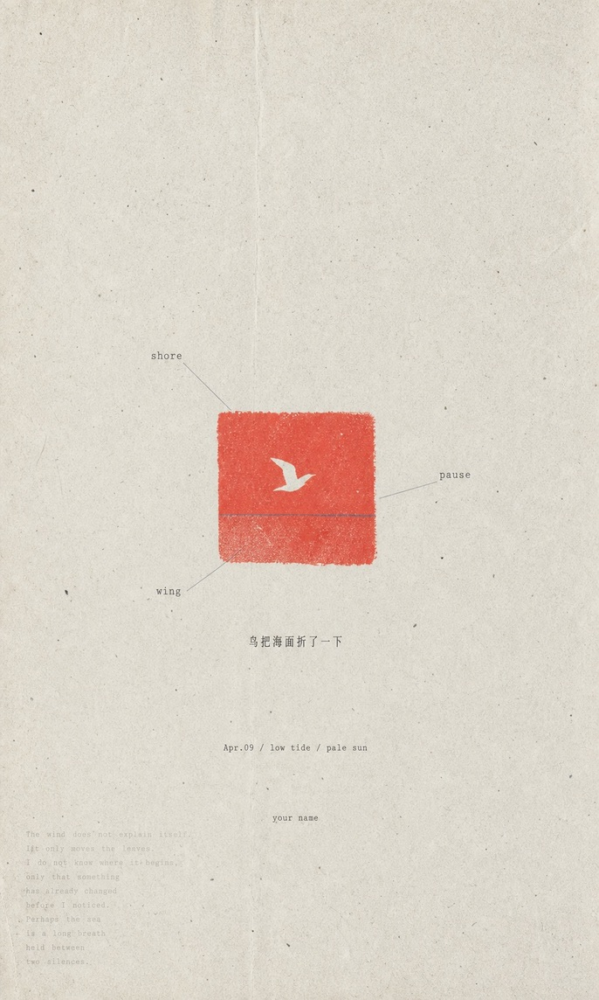

# GC 极简 Zine 海报

一个 Codex skill，可把主题、句子、物件、情绪、文章想法、照片或内容简报转换成安静的极简 zine 风格编辑海报提示词，并生成对应的位图图像。

> 来源：[LiamGvchi/gc-minimal-zine-poster](https://github.com/LiamGvchi/gc-minimal-zine-poster)，于 2026 年 7 月 23 日保存到本地。可调用名称和 Markdown 格式已针对本知识库做了轻量统一。

可调用的 skill 名称为 `gc-minimal-zine-poster`。

## 视觉方向

该 skill 会把每个请求编译为一张稀疏的竖向纸张海报，具有：

- 3:5 旧纸画布
- 70%–90% 留白
- 一个小型可成像主体或视觉组
- 衬线体、打字机体或等宽字体
- 一个清晰可见的高饱和色彩锚点
- 影印、孔版印刷、半色调、凸版印刷或扫描纸张瑕疵
- 安静的日系／韩系独立 zine 或极简编辑气质

它会避免商业广告布局、光泽样机、电影式布光、3D 渲染、霓虹、密集剪贴簿和长而规整的文字块。

## 示例

| Night Door                              | Yellow Step                               |
| --------------------------------------- | ----------------------------------------- |
|  |  |

| Shore Pause                               | Pause Map                             |
| ----------------------------------------- | ------------------------------------- |
|  |  |

| Typhoon Memory                                  | Moon Tide                             |
| ----------------------------------------------- | ------------------------------------- |
|  |  |

## 安装

把公开仓库直接克隆到 Codex skills 目录：

```bash
git clone https://github.com/LiamGvchi/gc-minimal-zine-poster.git \
  ~/.codex/skills/gc-minimal-zine-poster
```

如果 skill 没有立即出现，请重新启动 Codex。

## 使用

按名称调用 skill，并提供主题或简报：

```text
用 $gc-minimal-zine-poster 做一张关于雨天旧书店的海报
```

也可以提供句子、文章想法、物件、情绪或参考图像。

## 输出

每次生成请求都会返回：

1. 生成的海报位图
2. 最终图像生成提示词
3. 所选变化配方和一句简短的诠释说明

工作流默认使用标准模式并生成图像。只有用户明确要求只要提示词时，才会在提示词阶段停止。

## 仓库结构

- `SKILL.md`：完整的 Codex skill 指令
- `README.md`：公开概览和安装说明
- `LICENSE`：MIT 许可证
- `examples/`：精选生成海报

本仓库发布一个独立 skill。另一个私有仓库可能会集中备份多个本地 skill，但这里刻意不包含私有备份自动化和无关 skill。

## 许可证

MIT。参见 `LICENSE`。
